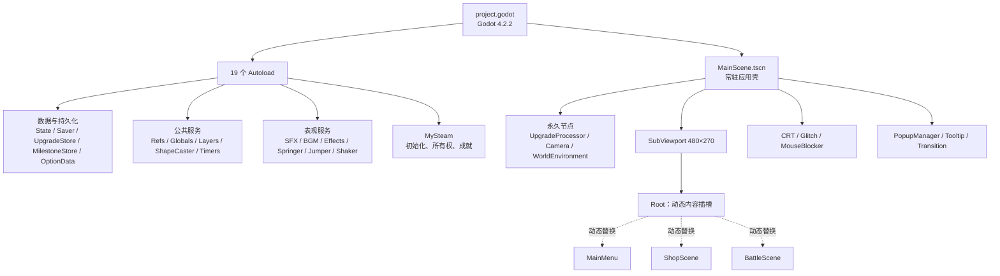
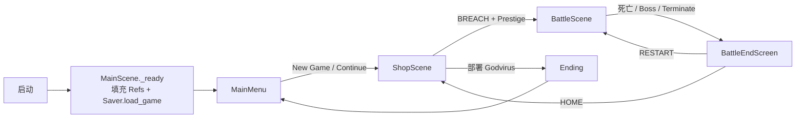
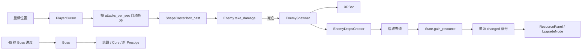
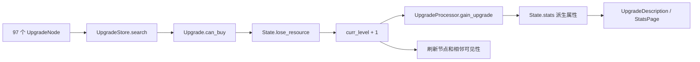
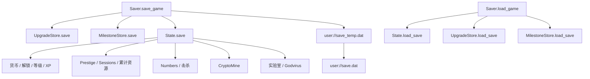
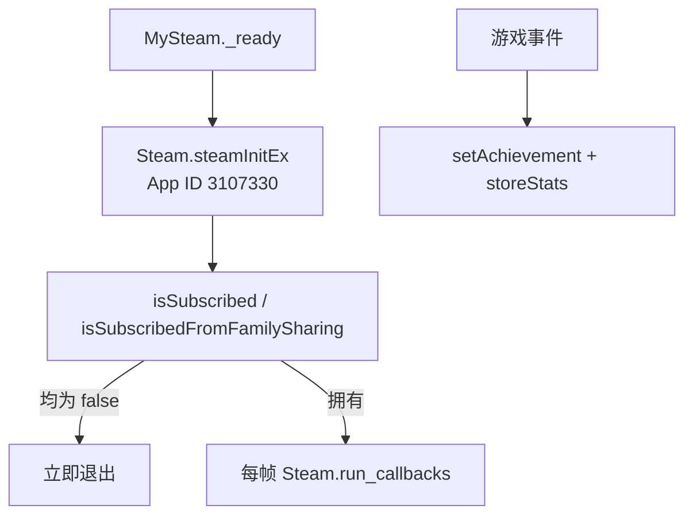

# Nodebuster 项目结构与文件功用

> 文档版本：`1.1-dev-environment`<br>
> 审阅日期：2026-07-28<br>
> 工程位置：`<本机开发目录>\Nodebuster\github-upload\project`<br>
> 目标版本：Godot `4.2.2.stable.official.15073afe3`，Windows x86_64<br>
> 状态：已完成全量分析、隔离运行验证及 Windows x64 开发/构建环境部署；环境批次未修改游戏逻辑<br>
> 基线说明：数值与 BUG 结论针对从发布包恢复的原始源码；GitHub `main` 已叠加并保留 `batch-1-steam-offline` 的离线/非 Steam 门控

## 1. 结论先行

该目录已经从 Nodebuster 的 Windows Steam 发布包恢复为可阅读、可编辑的 Godot 工程。当前判断如下：

- 原始发布包使用独立、未加密的 Godot PCK v2，目标引擎为 Godot 4.2.2。
- PCK 内有 645 个条目；全部条目的 MD5 校验通过。
- 88 个 GDScript 均为 UTF-8 源码，没有 `.gdc` 或 `.gde`，因此脚本并未经历反编译还原。
- 工程包含 39 个文本场景、19 个 Autoload、97 个升级、25 个里程碑、4 个 Shader、174 个 PNG、55 个 OGG 和 GodotSteam Windows x64 扩展。
- 39 个 `.tscn` 中没有序列化的 `[connection]`；信号全部由 GDScript 在运行时连接。
- 所有静态 `res://` 依赖均能解析；97 个升级图标和 25 个里程碑图标的动态命名依赖也全部存在。
- 原始 EXE 在无可用 Steam 客户端环境下会因所有权检查退出。为避免改动源码，运行验证使用了仓库外的隔离副本与测试专用 Steam Stub。
- 隔离副本在精确版本 Godot 4.2.2 中完成无缓存导入；第二次导入无脚本或资源错误。
- 自动流程冒烟测试已通过 `MainMenu → Shop → Battle`，退出码为 0。
- 已确认至少一个 PhysicsServer Shape RID 泄漏；其余基础 BUG 已列在 `REVERSE_ENGINEERED_GDD.md`，本批次没有修复。
- 原始 `export_presets.cfg` 已丢失；batch-4 已补建并验证 Windows x64 预设，但原始制作源文件和完整第三方许可清单仍缺，因此当前是“可编辑、可构建的恢复工程”，不是“可证明逐字节复现原发布构建的原作者仓库”。

## 2. 恢复来源、边界与完整性

### 2.1 原始发布包

原始文件保留在工程仓库的上一级目录，不纳入源码 Git 仓库：

| 文件 | 大小 | SHA-256 |
|---|---:|---|
| `Nodebuster.exe` | 69,934,592 B | `FF382B14C321200E80F71EA260C0C2959ACDDBF9E8AD84F4BFFEA77260211B44` |
| `Nodebuster.pck` | 30,746,352 B | `05EBCD97831EF07233E98E6042CB50B9B387D159D8535F6390BBC66A08611745` |
| `libgodotsteam.windows.template_release.x86_64.dll` | 2,229,248 B | `D251F9217E23B03C34171998802AE40F6A62E2E25957948E9DB5D25402510779` |
| `steam_api64.dll` | 300,392 B | `1ADD7F151FA644870A735AE86E68D1F019F296130D8E7C0A7ED3ECC7482DCCBC` |

EXE 内嵌版本字符串为：

```text
4.2.2.stable.official.15073afe3
```

其他发布属性：

- Windows GUI、x86_64。
- EXE 未做 Authenticode 签名。
- PCK 与 EXE 分离。
- PCK 魔数为 `GDPC`，格式版本 2，标志位为 0，即未加密。
- PCK 文件基址为 63,792。

### 2.2 恢复工具与产物

| 项目 | 位置或结果 |
|---|---|
| GDRE Tools | `<本机开发目录>\tools\gdre\v2.6.0\gdre_tools.exe` |
| GDRE Tools ZIP SHA-256 | `1C459C2CD575DC06DA09757EF1375A451B9CF421603913CFB3B82D5ED0F3B06D` |
| 原始 PCK 展开副本 | `<本机开发目录>\Nodebuster\raw_pck` |
| 可编辑工程 | `<本机开发目录>\Nodebuster\project` |
| 隔离验证副本 | `<本机开发目录>\validation\Nodebuster` |

恢复报告：

- 645 个 PCK 文件全部校验成功。
- 274 个导入资源成功转换，0 个失败。
- 232 个导入元数据被重写。
- `Lossy: 1`。
- 恢复工程连同 `.godot` 缓存共约 1,115 个文件、61.88 MiB。
- Git 应跟踪的源码与运行时资源约 605 个文件、33.21 MiB。

### 2.3 唯一有损恢复文件

`Lossy: 1` 几乎可以确定对应 `icon.svg`：

| 副本 | 大小 | 特征 |
|---|---:|---|
| `raw_pck/icon.svg` | 950 B | 原始紧凑 Godot SVG |
| `project/icon.svg` | 88,399 B | 带 `VTracer` 标记的矢量追踪重建文件 |

两者哈希不同。`Icon.ico` 的 raw/project 副本哈希一致。

因此：

- `project/icon.svg` 可正常作为运行时资源使用，但不是原始 SVG。
- 若以后恢复原 SVG，必须作为单独修改批次，记录前后哈希。
- 除该文件外，当前没有发现其他明确的有损恢复资源。

## 3. 编辑、运行与导出的前置条件

### 3.1 推荐环境

| 项目 | 要求 |
|---|---|
| Godot | 精确使用 4.2.2 stable 标准版，非 Mono |
| 平台 | Windows x86_64 |
| 渲染器 | Mobile |
| 原生扩展 | 项目内 GodotSteam Windows x64 DLL |
| Steam App ID | `3107330` |
| Steam 正式运行 | Steam 客户端可用，并且当前账号拥有游戏或满足家庭共享判断 |
| 开发运行 | 远端 `batch-1-steam-offline` 已加入离线/非 Steam 门控；发布构建继续执行 Steam 所有权检查 |

batch-4 已补建 `export_presets.cfg`，并用官方 Godot 4.2.2 Windows x64 模板完成实际导出。该预设能生成开发版 EXE、PCK 与 GodotSteam DLL，但不包含原版签名、Steam depot 或已丢失的原始导出参数，因此不能声称与原发布包逐字节一致。

### 3.2 画面与输入配置

| 配置 | 值 |
|---|---|
| 逻辑分辨率 | 480×270 |
| 默认窗口覆盖尺寸 | 1440×810 |
| 窗口调整大小 | 禁止 |
| 拉伸 | 整数倍、nearest 纹理过滤 |
| 全局主题 | `Themes/DefaultTheme.tres` |
| 输入 | 鼠标、左右键、WASD、LMB、RMB、Escape |
| 物理层 | Default、Enemies、EnemyDrops、PlayerAttacks、PlayerRadius |

## 4. 顶层目录结构

```text
project/
├─ .gitattributes                 Git 文本/二进制属性
├─ .gitignore                     忽略 Godot 缓存与导出目录
├─ project.godot                  工程入口、Autoload、窗口、输入和层配置
├─ MainScene.tscn                 常驻应用壳与唯一主场景
├─ default_bus_layout.tres        SFX/BGM 音频总线
├─ Icon.ico                       Windows 图标
├─ icon.svg                       GDRE 追踪重建图标，唯一已知有损项
├─ GameScenes/                    主菜单、商店、战斗、遗留 Logo
├─ Scenes/                        可复用玩法、UI、敌人、粒子和弹窗场景
├─ Scripts/                       88 个 GDScript
├─ Sprites/                       174 个 PNG 运行时图片
├─ Audio/                         9 首 BGM、46 个 SFX
├─ Shaders/                       4 个 Canvas Shader
├─ Themes/                        全局主题与 2 个字体
├─ addons/godotsteam/             GodotSteam GDExtension 与 Windows DLL
├─ docs/                          本次逆向文档
└─ .godot/                        本机生成缓存，不进入 Git
```

### 4.1 目录职责

| 目录 | 职责 |
|---|---|
| `GameScenes/` | 三个主流程内容场景及一个未使用 Logo 场景 |
| `Scenes/Battle/` | 自动移动脉冲器 |
| `Scenes/Effects/` | 背景粒子与方框效果 |
| `Scenes/Enemies/` | 正式敌人继承体系 |
| `Scenes/Particles/` | 命中、升级、脉冲粒子 |
| `Scenes/Player/` | Pulse Bolt |
| `Scenes/Popups/` | 确认、选项、Prestige、菜单和 Credits |
| `Scenes/Shop/` | 升级、里程碑、属性条目 |
| `Scenes/UI/` | 结算、按钮、资源、Tooltip、升级说明等复用 UI |
| `Scripts/Autoloads/` | 全局状态、存档、Steam、音频、效果和计时服务 |
| `Scripts/Battle/` | 战斗配置、敌人生成、掉落、生命与 XP |
| `Scripts/Systems/` | Stats、Numbers、CryptoMine 纯数据系统 |
| `Sprites/UpgradeIcons/` | 97 个升级 ID 的动态图标与 2 个测试图 |
| `Sprites/MilestoneIcons/` | 25 个里程碑 ID 的动态图标与 1 个测试图 |

## 5. 运行时架构



重要特征：

- 不调用 `SceneTree.change_scene*()`。
- `MainScene` 始终存活，菜单、商店和战斗按需挂到 `%Root`。
- `Refs` 是 Service Locator，保存永久节点和当前场景的强类型引用。
- `Initializer.gd` 在 Shop/Battle 进入树时刷新临时引用。
- 游戏主要内容运行在 480×270 的 SubViewport 中。
- 掉落物的物理查询刻意使用默认 `World2D`；源码注释表明这是对 SubViewport 物理问题的规避。

### 5.1 主流程



切换的一般顺序：

1. 需要时调用 `Saver.save_game()`。
2. 播放 `SceneTransition.transition_in()`，锁定鼠标并处理 BGM 低通/音量。
3. 释放当前内容场景。
4. 等待一帧。
5. 实例化目标场景到 `%Root`。
6. 更新 `Refs.curr_scn` 并连接场景信号。
7. 播放转场退出。
8. 调用 `BaseScene.setup()`。

### 5.2 战斗数据流



### 5.3 商店数据流



## 6. 19 个 Autoload

初始化顺序来自 `project.godot`，顺序本身有依赖意义。

| 顺序 | Autoload | 文件 | 功用 |
|---:|---|---|---|
| 1 | `Layers` | `Scripts/Autoloads/Layers.gd` | 将项目物理/渲染层名称转换为索引与位掩码 |
| 2 | `Defer` | `Scripts/Autoloads/Defer.gd` | 提供全局“下一帧”信号与延迟调用 |
| 3 | `Refs` | `Scripts/Autoloads/Refs.gd` | Service Locator；保存永久节点、当前场景节点和预载弹窗 |
| 4 | `Saver` | `Scripts/Autoloads/Saver.gd` | 聚合 State、Upgrade、Milestone 的新档、保存和读取 |
| 5 | `UpgradeStore` | `Scripts/Autoloads/Stores/UpgradeStore.gd` | 定义 97 个升级及其价格、等级、说明、图标与存档 |
| 6 | `MilestoneStore` | `Scripts/Autoloads/Stores/MilestoneStore.gd` | 定义 25 个里程碑、条件、奖励和领取状态 |
| 7 | `Globals` | `Scripts/Autoloads/Globals.gd` | 鼠标状态、掉落信号、爆炸和脉冲弹公共攻击逻辑 |
| 8 | `Springer` | `Scripts/Autoloads/Springer.gd` | 更新缩放、目标属性和独立弹簧 |
| 9 | `Jumper` | `Scripts/Autoloads/Jumper.gd` | 节点位置上冲与回弹 Tween |
| 10 | `Shaker` | `Scripts/Autoloads/Shaker.gd` | 噪声采样并作用到位置或数值属性 |
| 11 | `MyTimer` | `Scripts/Autoloads/Timer/MyTimer.gd` | 全局秒级、重复、实时与物理帧计时器 |
| 12 | `ShapeCaster` | `Scripts/Autoloads/ShapeCaster.gd` | 封装点、圆和矩形 PhysicsServer2D 查询 |
| 13 | `Effects` | `Scripts/Autoloads/Effects.gd` | 创建爆炸框、电流、浮字和粒子 |
| 14 | `State` | `Scripts/Autoloads/State.gd` | 货币、等级、解锁、Prestige、累计数据、矿场和实验室 |
| 15 | `SFX` | `Scripts/Autoloads/SFX.gd` | 50 路短音效池、冷却、随机音高和独立音源 |
| 16 | `BGM` | `Scripts/Autoloads/BGM.gd` | 9 首 BGM 队列、随机播放、音量与低通 Tween |
| 17 | `OptionData` | `Scripts/Autoloads/OptionData.gd` | 选项读取、保存、应用画面、窗口、音量和色板 |
| 18 | `RTLSizer` | `Scripts/Autoloads/RTLSizer.gd` | 用离屏 RichTextLabel 同步测量 BBCode 文本 |
| 19 | `MySteam` | `Scripts/Autoloads/MySteam.gd` | GodotSteam 初始化、所有权验证、回调与成就提交 |

`OptionData` 会等待一帧再应用 CRT、转场颜色等选项，使 `MainScene` 有时间填充 `Refs`。

## 7. 39 个场景逐文件功用

### 7.1 主流程与战斗场景

| 场景 | 功用 | 挂载脚本和关键依赖 |
|---|---|---|
| `MainScene.tscn` | 常驻应用壳、调度、后处理、弹窗、Tooltip、转场 | `MainScene.gd`；UpgradeProcessor、Camera、FPSLabel、PopupManager、CRT、Glitch |
| `GameScenes/MainMenu.tscn` | 标题、New Game、Continue、Options、Credits、Quit | `MainMenu.gd`；5 个 TextButton、BGParticles |
| `GameScenes/ShopScene.tscn` | 升级树、里程碑、矿机、实验室、属性页、资源栏、BREACH | `ShopScene.gd`；97 个 UpgradeNode、5 个页面、6 个 ResourcePanel |
| `GameScenes/BattleScene.tscn` | 单局战斗、敌人、掉落、血量、XP、Boss 进度和主动终止 | `BattleScene.gd`；EnemySpawner、EnemyDropsCreator、PlayerCursor、HealthBar、XPBar |
| `GameScenes/Logo.tscn` | 早期静态 Logo/标题候选 | `BaseScene.gd`；当前无入口引用 |
| `Scenes/Battle/MovingPulser.tscn` | 自动追踪敌人并周期范围攻击的升级实体 | `MovingPulser.gd`；TextureProgressBar |
| `Scenes/Ending.tscn` | Godvirus 部署、故障、静电/语音/VCR、Credits | `Ending.gd`；AnimationPlayer、4 路音频 |

### 7.2 敌人、玩家、粒子与效果

| 场景 | 功用 | 备注 |
|---|---|---|
| `Scenes/Enemies/BaseEnemy.tscn` | 正式敌人共同基类 | `Enemy.gd`、Area2D、血条、碰撞 |
| `Scenes/Enemies/EnemySquare.tscn` | 方形敌人 | 矩形碰撞、Square 纹理和 Mask |
| `Scenes/Enemies/EnemyPill.tscn` | 胶囊敌人 | 圆碰撞、波浪/旋转行为由脚本配置 |
| `Scenes/Enemies/EnemyCircle.tscn` | 圆形/爆炸者敌人 | 圆碰撞 |
| `Scenes/Enemies/EnemySpikyBall.tscn` | 刺球敌人 | 圆碰撞、特殊倍率由 Spawner 配置 |
| `Scenes/Enemies/EnemyPentagon.tscn` | 五边形分裂敌人 | 圆碰撞，死亡可分裂为 6 个小五边形 |
| `Scenes/Enemy.tscn` | 早期敌人原型 | 未引用；缺 `Enemy.gd` 必需的 `%TextureProgressBar` |
| `Scenes/Enemy2.tscn` | 早期刺球原型 | 未引用，已被继承体系替代 |
| `Scenes/Player/PulseBolt.tscn` | 直线脉冲弹 | `PulseBolt.gd`、Area2D、拉伸 1×1 Sprite |
| `Scenes/Particles/HitParticles.tscn` | 受击一次性线状粒子 | `AutoFreeParticles.gd` |
| `Scenes/Particles/LevelUpParticles.tscn` | 升级碎片爆发 | `AutoFreeParticles.gd` |
| `Scenes/Particles/PulseParticles.tscn` | 玩家脉冲线状特效 | 已预载但没有实例化 |
| `Scenes/Effects/BgParticles.tscn` | 低亮全屏背景粒子 | 菜单、商店、战斗复用 |
| `Scenes/Effects/CornerBox.tscn` | 光标框、命中框、闪烁消退方框 | `CornerBox.gd` |

### 7.3 弹窗、选项与商店条目

| 场景 | 功用 | 备注 |
|---|---|---|
| `Scenes/Popups/ConfirmationPopup.tscn` | Yes/No 确认框 | 发出 `chosen(bool)` |
| `Scenes/Popups/CreditEntry.tscn` | 制作人员条目和网址 | URL 子按钮挂 `URLButton.gd` |
| `Scenes/Popups/CreditsPopup.tscn` | 开发者和音乐来源 | 发出 `back` |
| `Scenes/Popups/GameMenu.tscn` | 商店内 Escape 菜单 | Options、Main Menu、Back |
| `Scenes/Popups/PrestigePicker.tscn` | 开战前选择已解锁 Prestige | Down、Up、Info、Start、Back |
| `Scenes/Popups/Options/OptionsPopup.tscn` | 显示、特效和音频设置 | 7 个选项行、3 个滑杆 |
| `Scenes/Popups/Options/OptionLine.tscn` | 离散枚举设置 | Label + MenuButton |
| `Scenes/Popups/Options/OptionSlider.tscn` | 连续数值设置 | Label + HSlider + 数值 |
| `Scenes/Shop/MilestoneEntry.tscn` | 单条里程碑、进度、奖励、领取 | `MilestoneEntry.gd` |
| `Scenes/Shop/StatEntry.tscn` | 单条属性名值对 | `StatEntry.gd` |
| `Scenes/Shop/UpgradeNode.tscn` | 升级树可点击节点 | `UpgradeNode.gd`、UpgradeIcon、连接数组 |

### 7.4 通用 UI

| 场景 | 功用 | 备注 |
|---|---|---|
| `Scenes/UI/BattleEndScreen.tscn` | 胜利/失败/主动终止结算、Home、Restart | `BattleEndScreen.gd` |
| `Scenes/UI/Buttons/MyButton.tscn` | 自绘按钮与弹性反馈基础 | `MyButton.gd` |
| `Scenes/UI/Buttons/TextButton.tscn` | 带 RichTextLabel 的通用文字按钮 | `TextButton.gd` 继承 MyButton |
| `Scenes/UI/ResourcePanel.tscn` | 单资源图标、数量、悬停提示和变化动画 | `ResourcePanel.gd` |
| `Scenes/UI/TextureProgressBar.tscn` | 像素风三层进度条 | 无脚本 |
| `Scenes/UI/UpgradeDescription.tscn` | 升级名、说明、等级、价格和购买状态 | `UpgradeDescription.gd` |
| `Scenes/UI/UpgradeIcon.tscn` | 升级图标与状态描边 | `UpgradeIcon.gd` |

## 8. 88 个脚本逐文件功用

### 8.1 根脚本

| 文件 | 功用 |
|---|---|
| `Scripts/AutoFreeParticles.gd` | 自动启动一次性 GPU 粒子，并在 `finished` 后释放 |
| `Scripts/BaseScene.gd` | MainMenu、Shop、Battle 的共同基类，提供 `setup()` |
| `Scripts/FPSLabel.gd` | 每帧显示 FPS；场景默认隐藏 |
| `Scripts/Initializer.gd` | 根据父场景把 Shop/Battle 关键节点写入 `Refs` |
| `Scripts/MainScene.gd` | 启动入口、引用初始化、内容切换、保存触发与调试快捷键 |
| `Scripts/MyCamera.gd` | 注册全局 Camera，并将镜头震动交给 `Shaker` |
| `Scripts/MyColors.gd` | 主色板与替代无障碍色板 |
| `Scripts/TypingLabel.gd` | Label 可见字符增加时播放打字音效 |
| `Scripts/TypingRTL.gd` | RichTextLabel 可见字符增加时播放打字音效 |
| `Scripts/Utils.gd` | 随机、几何、采样、BBCode、数字格式化等静态工具 |
| `Scripts/test.gd` | 未挂载的碰撞查询实验，只打印测试文本 |

### 8.2 Autoload、Store 与 Timer

| 文件 | 功用 |
|---|---|
| `Scripts/Autoloads/BGM.gd` | 9 首 BGM 的播放队列、随机播放、场景转场音量与低通 |
| `Scripts/Autoloads/Defer.gd` | “下一帧”信号及延迟调用 |
| `Scripts/Autoloads/Effects.gd` | 在当前场景创建爆炸框、电流、浮字和粒子 |
| `Scripts/Autoloads/Globals.gd` | 屏幕常量、鼠标锁、掉落信号、爆炸/脉冲弹公共攻击 |
| `Scripts/Autoloads/Jumper.gd` | Node2D/Control 的位置上冲和回弹 |
| `Scripts/Autoloads/Layers.gd` | 层名称到索引/位掩码的转换 |
| `Scripts/Autoloads/MySteam.gd` | Steam 初始化、App 所有权、回调和成就 |
| `Scripts/Autoloads/OptionData.gd` | 窗口、VSync、CRT、转场、色板与音量选项 |
| `Scripts/Autoloads/Refs.gd` | 永久/临时节点引用、碰撞掩码和预载弹窗 |
| `Scripts/Autoloads/RTLSizer.gd` | 离屏测量 RichTextLabel 文本尺寸 |
| `Scripts/Autoloads/Saver.gd` | 新档、临时文件写入、正式存档替换和读取 |
| `Scripts/Autoloads/SFX.gd` | 短音效播放器池、冷却、随机音高和独立音源 |
| `Scripts/Autoloads/Shaker.gd` | 噪声震动采样和属性应用 |
| `Scripts/Autoloads/ShapeCaster.gd` | 点、圆、矩形 PhysicsServer2D 查询 |
| `Scripts/Autoloads/Spring.gd` | 一维阻尼弹簧数据模型 |
| `Scripts/Autoloads/Springer.gd` | 全局更新缩放、目标属性和独立弹簧 |
| `Scripts/Autoloads/State.gd` | 持久状态、货币、等级、Prestige、矿场、实验室和信号 |
| `Scripts/Autoloads/Stores/UpgradeStore.gd` | 构建 97 个升级，提供查询、重置、保存和读取 |
| `Scripts/Autoloads/Stores/MilestoneStore.gd` | 构建 25 个里程碑，提供查询、重置、保存和读取 |
| `Scripts/Autoloads/Timer/FrameInstance.gd` | 物理帧计时器的数据和信号对象 |
| `Scripts/Autoloads/Timer/MyTimer.gd` | 统一更新时间、重复、实时和物理帧计时器 |
| `Scripts/Autoloads/Timer/TimeInstance.gd` | 秒级计时器、重复参数和完成/终止信号 |

### 8.3 战斗、敌人和玩家

| 文件 | 功用 |
|---|---|
| `Scripts/Battle/BattleScene.gd` | 配置 Prestige 0–25、被动掉血、45 秒 Boss、统计和结算 |
| `Scripts/Battle/EnemyDropsCreator.gd` | 用 PhysicsServer/RenderingServer 批量创建、拾取和释放掉落 |
| `Scripts/Battle/EnemySpawner.gd` | 权重生成敌人/Boss，配置成长，并处理死亡、XP、分裂和奖励 |
| `Scripts/Battle/MovingPulser.gd` | 自动寻敌、移动并周期范围攻击 |
| `Scripts/Battle/PlayerHealthBar.gd` | 玩家最大/当前生命、UI 和死亡信号 |
| `Scripts/Battle/XPBar.gd` | XP 曲线、连续升级、SP、UI 和等级成就 |
| `Scripts/Enemy/Enemy.gd` | 敌人生命、移动、波浪、旋转、受伤、暴击、死亡和越界 |
| `Scripts/Enemy/EnemyDrop.gd` | 第一版节点式掉落实验；主路径未使用 |
| `Scripts/Enemy/EnemyDrop2.gd` | 第二版 PhysicsServer 掉落实验；主路径未使用 |
| `Scripts/Player/Lightning.gd` | 链式查询目标并分段造成闪电伤害 |
| `Scripts/Player/PlayerCursor.gd` | 鼠标跟随、自动脉冲、换血、护甲、Pulse Bolt 和拾取 |
| `Scripts/Player/PulseBolt.gd` | 直线弹体、穿行命中、寿命和终点爆炸 |

### 8.4 效果、菜单、弹窗与选项

| 文件 | 功用 |
|---|---|
| `Scripts/Effects/CornerBox.gd` | 可调方框、弹性脉冲和闪烁消失 |
| `Scripts/Effects/ElectricityEffect.gd` | 两点之间的随机多层 Line2D 电流 |
| `Scripts/Effects/FloatingText.gd` | 上浮、打字、闪烁并自动释放的文本 |
| `Scripts/Effects/SceneTransition.gd` | 遮罩、状态文字、鼠标锁、音效和 BGM 滤波 |
| `Scripts/Effects/SquareImpact.gd` | 短暂矩形命中特效 |
| `Scripts/MainMenu/MainMenu.gd` | 主菜单按钮、Continue 可见性和标题打字动画 |
| `Scripts/Popups/ConfirmationPopup.gd` | Yes/No 选择结果 |
| `Scripts/Popups/CreditsPopup.gd` | Credits 返回信号 |
| `Scripts/Popups/GameMenu.gd` | 商店 Escape 菜单、Options、Main Menu、Back |
| `Scripts/Popups/PopupManager.gd` | 弹窗栈、暗背景、焦点动画和上一弹窗恢复 |
| `Scripts/Popups/PrestigePicker.gd` | 在已解锁范围选择本局 Prestige |
| `Scripts/Options/OptionLine.gd` | MenuButton 形式的离散选项 |
| `Scripts/Options/OptionSlider.gd` | 数值滑杆、拖动鼠标锁和更新信号 |
| `Scripts/Options/OptionsPopup.gd` | 生成分辨率列表并绑定全部选项到 `OptionData` |

### 8.5 商店、里程碑、系统与升级

| 文件 | 功用 |
|---|---|
| `Scripts/Shop/CryptoMinePage.gd` | Bits 存入、Netcoin 预估、剩余时间和 Processor 升速 UI |
| `Scripts/Shop/LabPage.gd` | Netcoin 研究进度、Godvirus 动画和结局触发 |
| `Scripts/Shop/MilestonesPage.gd` | 创建里程碑条目、领取奖励和通知红点 |
| `Scripts/Shop/ShopScene.gd` | 商店页签、资源、解锁、Prestige 弹窗、开战和 Escape 菜单 |
| `Scripts/Shop/StatEntry.gd` | 单条属性名/值、Tooltip 和数值反馈 |
| `Scripts/Shop/StatsPage.gd` | 创建并刷新所选 Prestige 的战斗属性 |
| `Scripts/Shop/UpgradeNode.gd` | 升级节点数据绑定、资源监听、点击和悬停 |
| `Scripts/Shop/UpgradesPage.gd` | 升级树键盘移动、右键拖动和鼠标中心缩放 |
| `Scripts/Shop/UpgradeTree.gd` | 节点连线、可见性、购买、邻接刷新和平移边界 |
| `Scripts/Milestones/Milestone.gd` | 里程碑 ID、图标、条件、奖励和领取数据 |
| `Scripts/Milestones/MilestoneEntry.gd` | 里程碑 UI、进度、领取和 claimed 写回 |
| `Scripts/Systems/CryptoMine.gd` | 按矿机等级把已存 Bits 持续转换为 Netcoin |
| `Scripts/Systems/Numbers.gd` | 总击杀及红/蓝/黄敌人击杀数 |
| `Scripts/Systems/Stats.gd` | 非持久化的战斗、掉落、生成和特殊攻击派生属性 |
| `Scripts/Enums/ResourceType.gd` | 六种资源枚举、名称、图标、颜色和 BBCode |
| `Scripts/Enums/Sound.gd` | SFX 使用的声音枚举 |
| `Scripts/Upgrades/Upgrade.gd` | 单项升级数据、等级、价格、上限和购买条件 |
| `Scripts/Upgrades/UpgradeProcessor.gd` | 将升级/里程碑效果应用到 State/Stats，并检查解锁条件 |

### 8.6 UI 与结局

| 文件 | 功用 |
|---|---|
| `Scripts/UI/BattleEndScreen.gd` | 结算状态、当局资源、Home/Restart 和累计资源成就 |
| `Scripts/UI/Buttons/MyButton.gd` | RenderingServer RID 自绘按钮与悬浮/按压/旋转/跳动反馈 |
| `Scripts/UI/Buttons/TextButton.gd` | MyButton 上的 RichText 文本和像素对齐修正 |
| `Scripts/UI/Buttons/URLButton.gd` | 用 `OS.shell_open()` 打开固定 URL |
| `Scripts/UI/MaxSizeRichTextLabel.gd` | 超过最大宽度时自动启用智能换行 |
| `Scripts/UI/ResourcePanel.gd` | 资源显示、State 信号订阅及增减动画 |
| `Scripts/UI/ScreenControl.gd` | UI 边界约束、上下定位和控件跟随 |
| `Scripts/UI/Tooltip.gd` | Tooltip 重置、内容、定位和弹性出现 |
| `Scripts/UI/UpgradeDescription.gd` | 升级名、说明、等级、价格和购买状态 |
| `Scripts/UI/UpgradeIcon.gd` | 动态图标与满级/可买/不可买描边 |
| `Scripts/Ending.gd` | Godvirus、Glitch、音频、屏幕冻结、Credits 和返回菜单 |

## 9. 资源与内容文件

### 9.1 Shader

| 文件 | 状态 | 功用 |
|---|---|---|
| `Shaders/CRTShader.gdshader` | 使用中 | 鱼眼、色散、拖影、扫描线、RGB 栅格、暗角和内置 Bloom |
| `Shaders/GlitchScreenShader.gdshader` | 使用中 | MainScene 全屏故障效果 |
| `Shaders/BloomShader.gdshader` | 未引用 | 早期独立 Bloom；功能已整合进 CRT |
| `Shaders/GlitchShader.gdshader` | 未引用 | 面向单个纹理的旧故障 Shader |

### 9.2 主题与字体

| 文件 | 状态 | 功用 |
|---|---|---|
| `Themes/DefaultTheme.tres` | 使用中 | 黑底、填充/描边、Panel、Menu、Slider、Label/RichText 样式 |
| `Themes/retro-pixel-cute-prop.ttf` | 使用中 | 全局像素字体 |
| `Themes/Pixellari.ttf` | 未引用 | 疑似旧字体 |

### 9.3 Sprite

`Sprites/` 共 174 个 PNG，主要约定如下：

| 子目录/文件 | 功用 |
|---|---|
| `Square32.png` | 战斗中的玩家鼠标方块 |
| `1x1.png` | 拉伸生成 Pulse Bolt |
| `BoxCorners.png` | CornerBox |
| `LoadingCircle.png`、`Smile.png` | 结局演出 |
| `Transition2*.png` | 当前场景转场图集 |
| `Battle/` | MovingPulser 本体与 Mask |
| `Drops/` | 红、蓝、黄掉落；紫色未引用 |
| `Enemies/` | 五类正式敌人本体与 Mask |
| `Particles/` | Circle、Line、Shard，均使用 |
| `UI/` | 六种资源、Godvirus、通知点和控件皮肤 |
| `UpgradeIcons/` | 99 张：97 个正式 ID、1 个模板占位、1 个无用途测试图 |
| `MilestoneIcons/` | 26 张：25 个正式 ID、1 个模板占位 |

动态加载契约：

```text
Upgrade ID   -> res://Sprites/UpgradeIcons/<ID>.png
Milestone ID -> res://Sprites/MilestoneIcons/<ID>.png
```

修改 ID 时必须同步重命名图标，否则运行时加载失败。

### 9.4 Audio

| 目录/文件 | 内容 |
|---|---|
| `Audio/BGM/` | 9 首 HoliznaCC0 曲目，全部由 `BGM.gd` 预载 |
| `Audio/SFX/` | 46 个短音效，其中包含多套旧候选版本 |
| `default_bus_layout.tres` | SFX 总线约 -10.52 dB；BGM 带 500 Hz LowPassFilter |

正式路径使用 Hover5、Down2、Up4、Hit2、Pickup2、Plink3、Tick3、TransitionIn3 等后缀版本；较早编号的同类音效多为未引用候选。

### 9.5 GodotSteam

`addons/godotsteam/` 实际只包含：

- Windows x86_64 debug DLL。
- Windows x86_64 release DLL。
- `steam_api64.dll`。
- `godotsteam.gdextension`。

两个 GodotSteam debug/release DLL 的 SHA-256 相同，实际是同一二进制副本。描述文件还声明了 macOS、Linux 和 Win32 路径，但对应文件不存在。

## 10. 存档与选项

### 10.1 存档链路



特征：

- 存档是 `var_to_str()` 生成的明文 Variant 文本。
- `Stats` 不直接持久化；加载时先恢复默认 Stats，再由升级/里程碑重建派生属性。
- 选项单独保存在 `user://options.dat`。
- 保存触发点包括新游戏、进入 Shop、进入 Battle、返回主菜单、窗口关闭和病毒部署。
- 没有定时自动保存。
- 购买升级、领取里程碑、操作矿机后不会立即保存。
- 保存了 `version = 0`，但没有版本迁移逻辑。
- 临时文件写入后会替换正式存档，但不保留可回退备份。

## 11. Steam 链路



原发布包在当前环境中的实际日志为：

```text
Did Steam initialize?: { "status": 1, "verbal": "Could not determine Steam client install directory." }
User does not own this game
```

这说明原始发布包与恢复基线把“Steam 初始化失败”和“用户未拥有”合并为退出结果。远端 `main` 已在 `batch-1-steam-offline` 增加离线/非 Steam 门控，并在后续场景反编译批次中保留；因此该编辑器调试阻塞在当前远端已解除，同时仍保留发布构建的 Steam 所有权规则。

## 12. 未引用、不可达与测试残留

### 12.1 确认不在主场景可达图

- `GameScenes/Logo.tscn`
- `Scenes/Enemy.tscn`
- `Scenes/Enemy2.tscn`
- `Scripts/test.gd`
- `Scripts/Enemy/EnemyDrop.gd`
- `Scripts/Enemy/EnemyDrop2.gd`

其中 `Scenes/Enemy.tscn` 若被实例化，会因缺少 `%TextureProgressBar` 在 `Enemy.gd` 初始化时报错。

### 12.2 预载但未实例化

- `PlayerCursor.gd` 中的 `_pulse_particles`。
- `Scenes/Particles/PulseParticles.tscn`。

### 12.3 明确未引用资源

- Shader：`BloomShader.gdshader`、`GlitchShader.gdshader`。
- 字体：`Pixellari.ttf`。
- Sprite：`PurpleDrop.png`、`HealthBox.png`、`SkillNodeTest.png`、`Transition.png`、`TransitionInverse.png`、`UI/Shapes/2x2.png`、`PanelOutlineAndBG.png`、`TestUpgrade2.png`。
- 多个早期音效候选：Hover1–4、Down1、Up1–3、Hit1、Pickup1、Plink1–2、Tick1–2、TransitionIn1–2、Type 基础版等。

### 12.4 引用但疑似测试残留

- `Characters/CharacterTest.png`：只在 Shop 的隐藏 Sprite 上引用。
- `UpgradeIcons/TestUpgrade.png`：场景模板占位，运行时会被真实图替换。
- `MilestoneIcons/Test.png`：同上。
- `StatsPage` 存在且能构建条目，但 `ShopScene._ready()` 没有显示 `StatsTabBtn` 的路径，当前疑似不可达。

这些内容暂不删除，应在原版流程/截图比对后纳入单独清理批次。

## 13. 已知技术风险摘要

详细 BUG、复现依据和优先级见 `REVERSE_ENGINEERED_GDD.md` 的“已知问题”章节。结构层面的重点风险：

| 类型 | 风险 |
|---|---|
| 历史开发阻塞（恢复基线） | Steam 初始化或所有权失败会直接退出；远端 `batch-1-steam-offline` 已加入离线/非 Steam 门控 |
| 构建边界 | batch-4 已补建并验证 Windows x64 预设；原始导出配置、签名与 Steam depot 参数仍无法复现 |
| 平台 | GodotSteam 只存在 Windows x64 载荷 |
| 存档 | 无 schema/type 校验、无迁移、无持久备份回退 |
| 生命周期 | 战斗结算不停止 Spawner/存量攻击 |
| 服务器资源 | `EnemyDropsCreator` 未释放 `shape_rid`，已由运行日志确认 |
| 窗口 | 分辨率索引可能跨显示器越界，尺寸吸附可能仍超屏 |
| 恢复 | `icon.svg` 是唯一已知有损项 |
| 授权 | 没有完整源码、美术、字体、音乐和二进制再分发许可清单 |

## 14. 隔离验证记录

### 14.1 精确引擎

已使用官方 Godot 4.2.2 Windows 标准版，控制台报告：

```text
4.2.2.stable.official.15073afe3
```

下载 ZIP 按官方发布资产验证 SHA-512：

```text
49e2252f862f3a73b11d1d77e8dfd2966633aa49a9033a75e067df0f6daf0da7
accc91323a88f830daa6ef0ff2eefe2f53e1247afb10d56966f642bd5bc45877
```

### 14.2 无缓存导入

验证在 `<本机开发目录>\validation\Nodebuster` 进行：

- 不复制原工程 `.godot`。
- 首次启动重建所有导入缓存；构建全局类缓存期间出现的临时缺导入提示随后消失。
- 第二次导入只有 headless 光标/Blender 提示，没有资源或脚本错误。
- 仓库内源码没有为验证而修改。

### 14.3 流程冒烟测试

测试专用 Autoload 只存在于验证副本：

- `Validation/MySteamStub.gd`
- `Validation/FlowSmoke.gd`

实际输出：

```text
FLOW_SMOKE: main menu ready
FLOW_SMOKE: shop ready
FLOW_SMOKE: battle ready
```

进程退出码为 0。退出时报告：

- 1 个 `P12GodotShape2D` RID 泄漏，对应 `EnemyDropsCreator.shape_rid`。
- 192 个 CanvasItem RID；由于测试在流程到达 Battle 后立即强制退出，这一项需在自然场景退出测试中进一步拆分，暂不直接认定为正式流程泄漏。

## 15. 修改批次与版本策略

原则：不复制多套工程目录，使用 Git 提交和标签保存每一批可回退版本。远端已有历史必须快进保留，不以新的孤立基线覆盖。

已存在及本次批次：

| 批次 | 状态 | 内容 | 标签 |
|---|---|---|---|
| batch-0 | 已发布 | 恢复可编辑 Godot 工程 | `reconstructed-base` |
| batch-1 | 已发布 | Steam 离线/非 Steam 门控 | `batch-1-steam-offline` |
| batch-2 | 已发布 | 全工程场景转为可编辑 `.tscn`，保留 batch-1 | `batch-2-scene-decompile` |
| batch-3 | 已发布 | 全量项目结构说明与反向 GDD；不改游戏逻辑 | `batch-3-reverse-analysis` |
| batch-4 | 本次环境批次 | Godot 4.2.2、Windows x64 模板、导出预设、开发/构建脚本与实机验证；不改玩法 | `batch-4-dev-environment` |

建议的后续批次：

| 批次 | 内容 | 建议标签 |
|---|---|---|
| batch-5 | 存档 schema、版本、备份、迁移、错误反馈 | `batch-5-save-safety` |
| batch-6 | Prestige、伤害污染、Lab、Shaker 等确定性 BUG | `batch-6-deterministic-bugs` |
| batch-7 | 结算冻结、空目标保护、RID 释放 | `batch-7-battle-lifecycle` |
| batch-8 | 显示器变化、窗口尺寸、旧选项默认值 | `batch-8-options` |
| batch-9 | CryptoMine 空转、UI 无效刷新、热点分析 | `batch-9-performance` |
| 后续清理 | 遗留场景、资源、未调用 API、拼写 | 单独决定 |

每个修改批次至少记录：

- 目标与非目标。
- 修改文件。
- 行为变化。
- 存档兼容性。
- 自动/手动验证。
- 已知风险。
- 回退标签。

## 16. Git 边界与 GitHub 建议

当前权威 Git 工作树和工程入口为：

```text
<本机开发目录>\Nodebuster\github-upload
<本机开发目录>\Nodebuster\github-upload\project\project.godot
```

目标 GitHub 仓库已经存在，远端根目录布局为：

```text
docs/       分析、BUG 与批次文档
project/    Godot 工程
scripts/    环境部署、导入、编辑、运行与构建入口
tools/      恢复工具
```

本文中的 `Scripts/...`、`Scenes/...` 等工程路径均以远端 `project/` 为基准。便携 Godot 安装在 Git 仓库外的 `<本机开发目录>\tools\godot\4.2.2\`；构建产物位于已忽略的 `build/`。目标为私有仓库 `git@github.com:WangXP7/buster.git`。

仓库边界排除：

- 原始 `Nodebuster.exe` 和 `Nodebuster.pck`。
- `raw_pck/`。
- GDRE 与 Godot 工具。
- 验证副本和测试 Stub。

当前源码最大单文件约 3.67 MiB，基线无需 Git LFS。按已确认策略，不上传 EXE、PCK、`raw_pck/`；原始或新导出的 ZIP 也不应进入普通 Git 历史。

在完整权利链未确认前：

- GitHub 仓库默认应为 `private`。
- 不上传原始发布二进制。
- 不公开恢复源码、图片、字体、音乐或 GodotSteam DLL。
- 不在聊天中发送 GitHub 密码或 Personal Access Token；使用浏览器/OAuth/Git Credential Manager 授权。

## 17. 当前“可修改状态”判定

已经完成：

- 原始包、PCK 和二进制指纹固定。
- PCK 全量展开和 MD5 校验。
- 39 场景、88 脚本和所有主要资源遍历。
- 运行架构、存档、Steam、升级、战斗和结局链路理解。
- 精确 Godot 4.2.2 无缓存导入验证。
- MainMenu、Shop、Battle 自动流程冒烟验证。
- 基础 BUG 列表和建议批次划分。
- 原始发布包与验证副本隔离。
- 精确 Godot 4.2.2 self-contained 环境与 Windows x64 模板部署。
- Windows 导出预设、统一开发脚本、隔离测试存档和实际 Debug/Release 构建链。

已确认的发布信息：

- 目标仓库为私有仓库 `git@github.com:WangXP7/buster.git`。
- 不上传 EXE、PCK、`raw_pck/`。
- 保留远端 batch-0～3 的提交与标签历史，本次在其上新增 batch-4。

后续仍需处理：

- 如需公开仓库，先确认素材、音乐、字体、代码与第三方 DLL 的完整权利链。
- 正式发布前补 `rcedit` 资源写入、代码签名、Steam depot 与商店发布参数。
- 按独立批次修复本次列出的 BUG、补回归测试并做性能优化。

batch-4 只新增或修改环境、导出配置、脚本、文档，以及两份由 Godot 4.2.2 自动补齐默认字段的字体 `.import` 元数据；没有修改任何玩法 `.gd`、`.tscn` 或数值。
