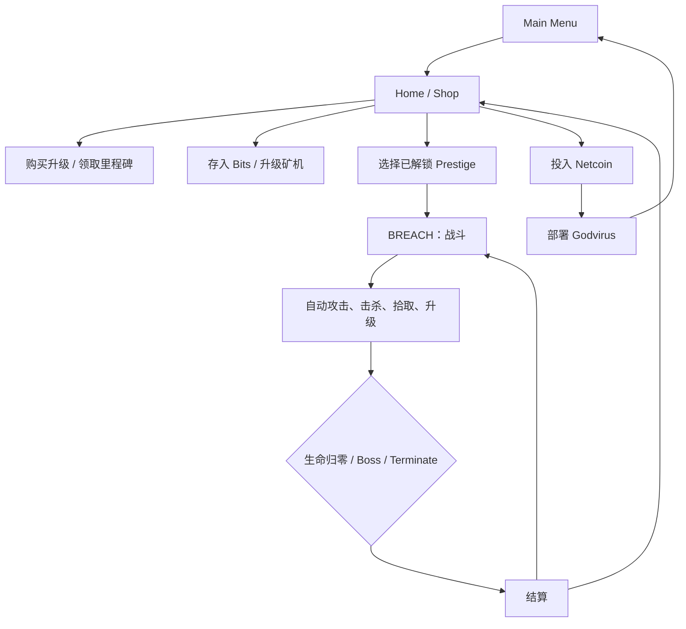

# Nodebuster 反向工程 GDD

> 文档版本：`1.0-analysis`<br>
> 反推日期：2026-07-23<br>
> 对应工程：Godot 4.2.2 / Steam App `3107330`<br>
> 文档性质：从发布包、恢复源码、场景、资源、运行日志和公开页面反向推导<br>
> 修改状态：本批次只记录设计与问题，不修复任何游戏逻辑<br>
> 路径约定：`Scripts/...`、`Scenes/...` 等路径均相对于 GitHub 仓库的 `project/`<br>
> 基线说明：数值与 BUG 结论针对原始恢复源码；远端 `main` 已包含不改变玩法的 `batch-1-steam-offline` 门控

## 1. 文档读法与证据级别

这不是原作者的原始设计稿，而是“实现即规格”的逆向 GDD。为了避免把推测写成事实，本文使用四种证据级别：

| 标记 | 含义 |
|---|---|
| **代码确认** | 可直接由当前 88 个 GDScript、39 个场景或资源数据证明 |
| **运行确认** | 已由原发布包日志或隔离 Godot 4.2.2 流程测试观察 |
| **公开确认** | 来自 Steam 官方商店、开发者页面、公告或成就页面 |
| **设计推断** | 根据实现和表现反推的设计意图；需要原作者确认 |

数值表默认表示“当前恢复版本的代码实际行为”。UI 文案与代码不一致时，会同时列出两者。

## 2. 产品定义

| 项目 | 反推结果 | 证据 |
|---|---|---|
| 名称 | Nodebuster | 公开确认、代码确认 |
| 开发者/发行者 | Goblobin | 公开确认 |
| Steam App ID | `3107330` | 公开确认、`MySteam.gd` |
| 平台 | Windows x86_64 | 发布包与原生扩展确认 |
| 模式 | 单人 | 公开确认、代码确认 |
| 类型 | 短篇实验性增量游戏，带自动战斗、Prestige 难度和技能树 | 公开确认、代码确认 |
| 输入重心 | 鼠标移动与点击；战斗攻击自动触发 | 代码确认 |
| 语言 | 英语 | 公开确认、资源文本确认 |
| Steam 能力 | 13 个成就、Steam Cloud | 公开确认 |
| 目标时长 | 约 3–5 小时完成主要内容 | 公开资料描述；具体玩家差异较大 |
| 终局 | 完成 Lab 研究并部署 Godvirus | 代码确认 |

### 2.1 一句话体验

玩家操纵一个跟随鼠标的蓝色攻击框，在不断增强的敌人流中自动脉冲，收集多层资源，回到 Home 扩展技能树和离线感矿机，逐级击败 0–25 Prestige 的 Boss，最终研究并部署 Godvirus。

### 2.2 设计支柱

以下为对现有实现的设计推断：

1. **极低操作门槛**：移动鼠标就是瞄准，攻击、拾取和大部分技能自动运行。
2. **高密度即时反馈**：掉落、数字、音效、震动、CRT、故障、粒子和升级节点同时强化成长感。
3. **多层货币门锁**：Bits → Nodes → Cores/SP → Processors/Netcoin → Lab，持续引出下一系统。
4. **短周期破关**：每个当前最高 Prestige 在 45 秒后出现 Boss，形成明确的局内目标。
5. **可重玩刷取**：已通关的低 Prestige 不再生成 Boss，可作为资源/XP 农场。
6. **有限内容中的指数观感**：敌人和资源从个位数增长到亿级，但规则保持简单。
7. **主题与机制统一**：节点、Bits、Processors、Netcoin、病毒、CRT 和故障画面共同构成抽象计算机世界。

## 3. 玩家体验与叙事框架

### 3.1 主题

游戏没有传统角色、对话或关卡叙事。叙事通过系统名词和演出表达：

- 玩家是一个不断扩展“影响范围”的蓝色方框/程序。
- 敌人是红、蓝、黄的几何“节点”。
- Home 是升级、里程碑、Crypto Mine 和 Laboratory 的控制台。
- 最终目标是将 1,000 Netcoin 投入 Godvirus。
- 部署后，画面故障、静电、语音、VCR、冻结帧和 Credits 构成“破坏现实/系统”的结局。

“玩家究竟是黑客、病毒还是自我扩张程序”没有被源码文本明确回答，属于设计留白。

### 3.2 情绪曲线


## 4. 核心循环

### 4.1 总循环



### 4.2 局内循环

1. 鼠标移动攻击框。
2. 攻击框按攻击频率自动发出方形脉冲。
3. 脉冲范围内每个敌人受到伤害，同时各自对玩家造成一次“反伤式”伤害。
4. 特殊攻击可能产生 Pulse Bolt、闪电或自动移动脉冲器。
5. 敌人死亡后产生 XP 和资源掉落。
6. 玩家靠近掉落物，或通过 Auto-collect，获得资源。
7. 当前最高 Prestige 经过 45 秒生成 Boss。
8. 击败 Boss、生命归零或主动 Terminate 后进入结算。

### 4.3 局外循环

1. 消耗六种资源推进 97 节点升级树。
2. 领取 25 个累计击杀里程碑。
3. 将 Bits 存入 Crypto Mine，持续转换为 Netcoin。
4. 用 Processor 将矿机从 0 级升到 36 级。
5. 用 Netcoin 购买后期升级，并向 Lab 投入 1,000 Netcoin。
6. 通过 Infinity1–9 到达 Laboratory 和终局。

## 5. 游戏状态与流程

### 5.1 Main Menu

功能：

- New Game。
- Continue，仅在存在 `save.dat` 时显示。
- Options。
- Credits。
- Quit。

新游戏在已有存档时显示覆盖确认；确认后重置 State、UpgradeStore 和 MilestoneStore。

### 5.2 Home / Shop

页面：

| 页面 | 解锁方式 | 功用 |
|---|---|---|
| Upgrades | 默认 | 97 节点技能树 |
| Milestones | 购买 `Milestones` | 25 个累计击杀目标 |
| Crypto Mine | 购买 `CryptoMine` | Bits → Netcoin、Processor 升速 |
| Laboratory | 购买 `Laboratory` | 1,000 Netcoin 研究和结局 |
| Stats | 场景和代码存在 | 当前没有显示 `StatsTabBtn` 的路径，疑似不可达 |

Home 顶部按当前页面显示 Bits、Nodes、Cores、SP、Netcoin、Processors。

### 5.3 Battle

- 进入时隐藏系统鼠标，显示蓝色攻击框。
- 生命按 Prestige 被动流失；升级提供固定和百分比回复。
- 普通敌人的生命与伤害随本局经过时间线性增长。
- 当前最高已解锁 Prestige 显示 45 秒 Boss 进度。
- 低于最高已解锁 Prestige 时隐藏进度，并永久跳过 Boss。
- 结算类型：失败、Boss 胜利、主动终止。
- 结算可 Home 或 Restart。

### 5.4 Ending

当 Lab 达到 1,000 且玩家点击 Deploy：

1. 显示 “Deploying” 4 秒。
2. 显示 “Virus deployed” 2 秒并提交成就。
3. 显示 Glitch，并在 2 秒后开始静电/故障 10 秒渐强。
4. 捕获并冻结当前画面，播放 Voice Loop 与 VCR 5 秒。
5. 显示 Credits，等待 2 秒后启动背景噪声。
6. 1 秒后播放 Credits Animation。
7. 动画结束后再等 5 秒，返回 Main Menu。

## 6. 操作与设置

### 6.1 操作

| 场景 | 操作 |
|---|---|
| Battle | 鼠标移动攻击框；攻击自动；点击 Terminate 主动结束 |
| Upgrade Tree | 左键购买/选择；右键拖动；滚轮缩放；WASD/方向键平移 |
| Menus | 鼠标点击、悬停 Tooltip |
| Shop | Escape 打开 Game Menu |

代码没有面向手柄或触摸的完整交互层。

### 6.2 设置

| 设置 | 默认 |
|---|---:|
| Window Size | Fullscreen |
| VSync | 开 |
| Screenshake | 90% |
| CRT Effect | 开 |
| Transition Color | 白 |
| Flashing FX | 开 |
| Color Palette | 默认 |
| Master Volume | 50% |
| SFX Volume | 100% |
| BGM Volume | 60% |

无障碍能力：

- 可降低屏幕震动。
- 可关闭 CRT。
- 可切换较灰的转场颜色。
- 可关闭闪烁效果。
- 有替代升级节点色板。

缺口：

- 没有完整键盘导航、手柄、重映射、字幕或色盲类型说明。
- Flashing/CRT/Glitch 的实际覆盖范围需要逐项验证。

## 7. 资源与经济

### 7.1 六种资源

| 资源 | 颜色 | 主要来源 | 主要用途 | 是否持久化 |
|---|---|---|---|---|
| Bits | 红 | 红敌人、里程碑 | 大部分早中期升级；存入矿机 | 是 |
| Nodes | 蓝 | 蓝敌人、里程碑 | 分支、特殊机制、后期升级 | 是 |
| Cores | 紫 | 当前最高 Prestige 的 Boss | 关键门锁、攻击速度、Infinity 链 | 是 |
| SP | 黄白 | 每次升级 1 点 | 稀缺的构筑型升级 | 是 |
| Netcoin | 绿色/币 | Crypto Mine | 后期升级、Lab 研究 | 是 |
| Processors | 黄 | 黄敌人、3 个里程碑 | 每次消耗 1 个提升矿机等级 | 是 |

### 7.2 资源解锁

- Nodes：首次持有大于 0 时显示。
- Cores：首次击败当前最高 Prestige Boss。
- SP：首次升级。
- Netcoin：矿机首次产出。
- Processors：首次获得黄色掉落或里程碑奖励。
- 对应资源面板依赖 `State.*_unlocked`。

### 7.3 掉落公式

标准红敌人：

```text
物理掉落个数 =
    (1 + Upgrade bit_boost + Prestige bit_boost)
    × 敌人 drop_mult
    × (双倍掉落触发 ? 2 : 1)

每个红掉落的 Bits =
    Prestige bit_value，经概率方式处理小数部分
```

标准蓝敌人：

```text
Nodes 掉落个数 =
    (1 + Upgrade node_boost + Prestige node_boost)
    × 敌人 drop_mult
    × (双倍掉落触发 ? 2 : 1)
```

黄色敌人：

- 固定产生 1 个 Processor。
- 不接受红/蓝数量加成、敌人 `drop_mult` 或双倍掉落。

自动收集发生在创建物理掉落之前，满级概率为 80%。

### 7.4 颜色概率

生成时先判定黄色，再判定蓝色：

```text
P(Yellow) = yellow_enemy_chance
P(Blue)   = (1 - P(Yellow)) × blue_enemy_chance
P(Red)    = 剩余概率
```

满级：

- 黄色名义概率 0.5%。
- 蓝色名义概率 5%，在黄色先判定后实际约 4.975%。
- 其余为红色。

### 7.5 升级总经济

| 消耗资源 | 升级节点数 | 总等级数 | 全部买满成本 |
|---|---:|---:|---:|
| Bits | 39 | 316 | 2,308,576 |
| Nodes | 20 | 82 | 47,459 |
| Cores | 17 | 19 | 19 |
| SP | 7 | 26 | 26 |
| Netcoin | 14 | 60 | 27.022 |
| **合计** | **97** | **503** | 分资源计算 |

额外终局成本：

- Lab 需要 1,000 Netcoin。
- 1 Netcoin = 100,000 Bits。
- 后期升级加 Lab 共需 1,027.022 Netcoin，即理论转换 102,702,200 Bits。
- 该数字不包含直接花在 Bits 升级树上的 2,308,576 Bits。

## 8. 战斗系统

### 8.1 基础玩家属性

| 属性 | 初始值 |
|---|---:|
| 固定伤害 | 1 |
| 攻击频率 | 0.5 次/秒 |
| 最大生命 | 10 |
| Armor | 0 |
| 攻击框基准边长 | 34 |
| 拾取半径 | 16 |
| 敌人生成基准 | 0.33 个/秒 |
| 暴击概率 | 0 |
| `crit_damage` | 1.0，即暴击时基础乘数 2× |
| 闪电链数 | 2 |

战斗开始时 `EnemySpawner.curr_spawn_delta = 2`，因此前几帧会立即生成两个敌人，随后进入稳定生成率。

### 8.2 攻击频率与范围

```text
实际攻击频率 =
    attacks_per_sec × (1 + attack_speed_mod)

攻击框边长 =
    player_size × (1 + player_size_mod)
```

当前满级攻击速度为：

```text
0.5 × (1 + 0.4) = 0.7 次/秒
```

### 8.3 主脉冲伤害

代码实际顺序：

```text
base_damage =
    fixed_damage
    + max_health × max_health_damage

area_damage =
    base_damage
    × (1 + 命中数 × damage_mod_per_enemy)

若目标为 Boss：
    area_damage ×= (1 + boss_damage_mod)

Enemy.take_damage 内再应用：
    满血增伤 / 半血以下处决 / 每秒叠伤
    暴击
```

注意：当前实现会原地修改共享的 `area_damage`；Boss 后遍历到的普通敌人可能错误继承 Boss 倍率，详见 BUG 列表。

### 8.4 敌人承受伤害

`Enemy.take_damage`：

```text
条件增伤 =
    敌人当前为满血 ? undamaged_mod : 0
    + 敌人生命 <= 50% ? execute_mod : 0
    + 战斗秒数 × damage_mod_per_sec

最终非暴击伤害 =
    输入伤害 × (1 + 条件增伤)

若暴击：
    最终伤害 ×= (1 + crit_damage)
```

两个条件不会同时成立，因为 `满血` 使用 `if`，`半血` 使用 `elif`。

### 8.5 玩家受到伤害

敌人不会通过弹幕或普通接触独立攻击。每当玩家主脉冲命中一个敌人，该敌人对玩家结算一次伤害：

```text
armor_base =
    fixed_armor + max_health × max_health_armor

armor_mod =
    1
    + 命中数 × armor_mod_per_enemy
    + (命中数 <= 8 ? focus_armor_mod : 0)
    + 战斗秒数 × armor_mod_per_sec

normal_armor = armor_base × armor_mod

boss_armor =
    (normal_armor + fixed_boss_armor)
    × (1 + boss_armor_mod)

受到伤害 = max(enemy.damage - 对应 armor, 0)
```

此外每秒结算：

```text
生命变化/秒 =
    -Prestige 被动流失
    + 固定生命回复
    + 最大生命 × 百分比生命回复
```

这使战斗的核心决策不是躲避弹幕，而是控制一次脉冲框住多少敌人：更多敌人提高群体增伤/护甲，也会同时触发更多次敌方伤害。

### 8.6 回复来源

| 来源 | 触发 |
|---|---|
| 固定 Regen | 每秒 |
| 最大生命百分比 Regen | 每秒 |
| Salvaging | 每次击杀 |
| Lifesteal 固定值 | 每次主脉冲/Pulse Bolt/闪电/爆炸命中 |
| Lifesteal 最大生命比例 | 同上 |
| Drop Heal | 每次收集一个掉落 |
| Steal Max Health | 每次击杀永久增加本局及存档中的 Bonus Max Health |

“Steal Max Health” 增加 `State.bonus_max_health`，会跨局持久化，因此理论上没有上限。

### 8.7 特殊攻击

| 系统 | 解锁与行为 |
|---|---|
| Pulse Bolts | 基础解锁产生 3 枚，最高 10 枚，围绕 360° 发射，速度 300，寿命随机 0.4–0.6 秒 |
| Pulse Bolt Explosion | 购买后让弹体在寿命结束时产生 64 宽爆炸；无论是否购买，弹体都会在寿命结束时释放 |
| Enemy Death Pulse Bolts | 敌人死亡最高 6% 概率从死亡点发射整组 Pulse Bolts |
| Moving Pulser | 最高 5 个；自动追踪敌人并每隔一段时间发出 45° 方形爆炸 |
| Lightning | 每次任意攻击命中最高 25% 概率触发；最高 10 链，链距 80，链间隔 0.06 秒 |
| Exploder | 将普通生成池中的 5% Square 替换为圆形 Exploder；死亡产生范围爆炸 |

满级特殊攻击：

- Pulse Bolts：10 枚，伤害修正 +550%，即前置乘数 6.5×。
- Moving Pulser：5 个，范围 +200%（3×），攻击速度 +100%，移动速度 +100%。
- Lightning：25% 触发，10 链，伤害 +400%（5×）。
- Exploder：5% 生成替换，爆炸范围 +75%。

## 9. 敌人设计

### 9.1 敌人变体

| 内部类型 | 外观/运动 | 生命倍率 | 伤害倍率 | 掉落倍率 | XP 倍率 | 特殊行为 |
|---|---|---:|---:|---:|---:|---|
| `Square` | 旋转方块 | 1.0 | 1.0 | 1.0 | 1.0 | 基础敌人 |
| `SmallSquare` | 更小、更快 | 0.6 | 1.0 | 1.0 | 1.0 | 速度 30–36 |
| `BigSquare` | 巨大、较慢 | 5.0 | 1.0 | 3.0 | 4.0 | 黄色池排除 |
| `Exploder` | 圆形 | 1.0 | 1.0 | 1.0 | 1.0 | 死亡爆炸 |
| `Pill` | 胶囊、波浪 | 1.0 | 1.0 | 1.0 | 1.0 | 旋转朝速度方向 |
| `Pentagon` | 大五边形 | 3.0 | 1.0 | 2.0 | 2.0 | 死亡分裂 6 个小五边形；黄色池排除 |
| `PentagonSmall` | 小五边形 | 0.6 | 1.0 | 1.0 | 1.0 | 只由分裂产生 |
| `Spiky` | 刺球 | 2.0 | 3.0 | 4.0 | 2.0 | 高风险高奖励 |
| `Boss` | 大方块 | 独立表 | 独立表 | Core | 不按普通表 | 越界后重新放置；P18+ 彩虹 |

所有普通敌人从屏幕外随机边缘生成，并朝镜头附近的随机穿越点移动；越界后释放。Boss 越界时不会释放，而会重新随机放置。

### 9.2 类型生成池

| Prestige | 类型权重 |
|---:|---|
| 0 | Square 100% |
| 1–3 | Square 86%、Small 10%、Big 4% |
| 4 | Square 78%、Small 10%、Big 4%、Pill 8% |
| 5–8 | Square 73%、Small 10%、Big 4%、Pill 8%、Pentagon 5% |
| 9–25 | Square 71%、Small 10%、Big 4%、Pill 8%、Pentagon 5%、Spiky 2% |

黄色敌人使用复制后的池，但移除 BigSquare 和 Pentagon。Exploder 的替换发生在普通池上，因此黄色敌人不会成为 Exploder。

## 10. Prestige 与 Boss

### 10.1 规则

- 初始 `max_prestige = 0`、`curr_prestige = 0`。
- 当前最高 Prestige 的战斗在 45 秒后生成 Boss。
- 击败当前最高 Boss：
  - 获得 1 Core。
  - 若当前最高小于 25，则 `max_prestige` 和 `curr_prestige` 各加 1。
- 重玩低于最高的 Prestige：
  - 不显示 Boss 进度。
  - 不生成 Boss。
  - 只能刷资源、XP，或 Terminate。
- 选择上限硬限制为 25。

### 10.2 P0–P12 战斗参数

普通敌人生命/伤害在本局内按 `基础值 + 每秒增长 × 时间`。

| P | 敌人 HP | HP/s | 敌人伤害 | 伤害/s | Boss HP | Boss 伤害 | XP | 被动掉血/s | 速度倍率 |
|---:|---:|---:|---:|---:|---:|---:|---:|---:|---:|
| 0 | 3 | 0.15 | 0.4 | 0.015 | 120 | 5 | 1 | 0.2 | 1.00 |
| 1 | 10 | 0.5 | 1 | 0.04 | 800 | 10 | 2 | 0.6 | 1.00 |
| 2 | 35 | 1.5 | 2.5 | 0.1 | 2,000 | 25 | 3 | 1.2 | 1.10 |
| 3 | 100 | 4 | 8 | 0.3 | 8,000 | 75 | 5 | 3.6 | 1.20 |
| 4 | 300 | 12 | 20 | 1 | 24,000 | 240 | 7 | 10 | 1.30 |
| 5 | 800 | 36 | 65 | 3 | 70,000 | 630 | 9 | 30 | 1.50 |
| 6 | 2,400 | 108 | 200 | 9 | 210,000 | 1,500 | 11 | 90 | 1.65 |
| 7 | 7,200 | 300 | 600 | 26 | 600,000 | 4,500 | 13 | 270 | 1.80 |
| 8 | 21,000 | 900 | 1,800 | 78 | 1,800,000 | 13,500 | 15 | 810 | 2.00 |
| 9 | 60,000 | 2,700 | 5,300 | 230 | 5,400,000 | 40,000 | 18 | 2,400 | 2.00 |
| 10 | 180,000 | 8,100 | 15,600 | 690 | 16,200,000 | 120,000 | 21 | 7,200 | 2.10 |
| 11 | 540,000 | 24,000 | 45,000 | 2,100 | 48,600,000 | 360,000 | 24 | 21,600 | 2.20 |
| 12 | 1,500,000 | 60,000 | 150,000 | 6,000 | 145,000,000 | 1,000,000 | 27 | 60,000 | 2.20 |

P13–P25 继续使用 P12 的生命、伤害、Boss、被动掉血和速度，只提升 XP 与资源收益。

### 10.3 Prestige 掉落与 XP 增益

`Bit +`、`Node +` 是每个标准对应颜色敌人的额外物理掉落数量；`Bit value` 是每个红掉落实际兑换的 Bits。

| P | XP | Bit + | Node + | Bit value |
|---:|---:|---:|---:|---:|
| 0 | 1 | 0 | 0 | 1 |
| 1 | 2 | 1 | 0 | 1 |
| 2 | 3 | 3 | 0 | 1 |
| 3 | 5 | 5 | 0 | 1 |
| 4 | 7 | 8 | 0 | 1 |
| 5 | 9 | 13 | 1 | 1 |
| 6 | 11 | 18 | 2 | 1 |
| 7 | 13 | 18 | 3 | 1.4 |
| 8 | 15 | 18 | 4 | 2 |
| 9 | 18 | 18 | 5 | 3 |
| 10 | 21 | 18 | 7 | 4 |
| 11 | 24 | 18 | 7 | 6 |
| 12 | 27 | 18 | 9 | 8 |
| 13 | 30 | 18 | 11 | 10 |
| 14 | 34 | 18 | 13 | 12 |
| 15 | 38 | 18 | 15 | 15 |
| 16 | 42 | 18 | 18 | 19 |
| 17 | 46 | 18 | 18 | 25 |
| 18 | 50 | 18 | 18 | 32 |
| 19 | 54 | 18 | 18 | 40 |
| 20 | **62** | 18 | 18 | **70** |
| 21 | 66 | 18 | 18 | 110 |
| 22 | 70 | 18 | 18 | 200 |
| 23 | 74 | 18 | 18 | 360 |
| 24 | 78 | 18 | 18 | 520 |
| 25 | 82 | 18 | 18 | 720 |

P20 的预期中间档很可能是 XP 58、Bit value 50，但代码把该条件误写为第二个 P19，因此实际直接跳到 62/70。

## 11. 等级、XP 与 SP

### 11.1 规则

- 普通敌人死亡提供 `Prestige XP × 敌人 XP 倍率`。
- Boss 也通过同一死亡路径提供 XP。
- 每次升级：
  - `State.level += 1`。
  - 获得 1 SP。
  - 播放升级粒子、浮字、音效。
- XP 可一次跨越多个等级。
- 等级没有硬上限；达到 25 仅触发成就。

### 11.2 单级 XP 需求

| 等级 | 需求 | 等级 | 需求 | 等级 | 需求 |
|---:|---:|---:|---:|---:|---:|
| 0→1 | 50 | 9→10 | 14,000 | 18→19 | 53,000 |
| 1→2 | 300 | 10→11 | 18,000 | 19→20 | 58,000 |
| 2→3 | 800 | 11→12 | 22,000 | 20→21 | 63,000 |
| 3→4 | 2,000 | 12→13 | 26,000 | 21→22 | 68,000 |
| 4→5 | 3,400 | 13→14 | 30,000 | 22→23 | 73,000 |
| 5→6 | 5,200 | 14→15 | 34,000 | 23→24 | 78,000 |
| 6→7 | 7,000 | 15→16 | 38,000 | 24→25 | 83,000 |
| 7→8 | 9,000 | 16→17 | 43,000 | 25→26 | 88,000 |
| 8→9 | 11,000 | 17→18 | 48,000 | 26+ | 每级再 +5,000 |

买满全部 SP 升级需要 26 SP，即至少完成 26 次升级。

## 12. 升级树

### 12.1 结构

- 97 个 UpgradeNode。
- 98 条邻接边。
- 96 个非根节点解锁条件。
- 所有解锁条件与场景邻接关系匹配。
- 唯一根节点是 `Damage1`。
- 购买立即扣资源、提升等级、应用效果并刷新相邻节点。
- 存档只保存各 ID 的等级；加载后逐级重新应用效果。

### 12.2 满级关键属性

以下是当前代码实际值，不包含 Prestige 参数和永久击杀成长：

| 属性 | 满级结果 |
|---|---:|
| 固定伤害 | 681 |
| 最大生命 | 765,946 |
| 固定 Armor | 1,265 |
| 暴击概率 | 100% |
| `crit_damage` | 22，代码最终暴击倍率为 23× |
| Boss 增伤 | +1,500%，即 16× |
| 固定 Regen | 4.5/秒 |
| 最大生命 Regen | 20%/秒 |
| 最大生命转 Armor | 10% |
| 最大生命转伤害 | 0.1% |
| 主脉冲每敌人增伤 | +25% |
| 主脉冲每敌人 Armor | +20% |
| <=8 敌人时 Armor | 额外 +250% |
| 每秒叠伤 | +3%/秒 |
| 每秒叠 Armor | +5%/秒 |
| 满血目标增伤 | +550% |
| 半血以下增伤 | +550% |
| 蓝敌人概率 | 5% |
| 黄敌人概率 | 0.5% |
| 双倍掉落概率 | 50% |
| 自动收集概率 | 80% |
| 每次击杀永久最大生命 | +8；购买 Infinity1 后合计 +20 |
| 生成倍率 | Infinity1 前 36×；购买后 46× |

`Size3` 存在代码/文案错误，因此满级攻击框按当前代码是：

```text
(34 + 3) × (1 + 1.5) = 92.5
```

而不是在已有结果上再增加 100%。

### 12.3 完整升级清单

下表中的“总成本”是该节点全部等级之和，“实际效果/级”来自 `UpgradeProcessor.gd`。

| # | ID | UI 显示名 | 资源 | 等级 | 总成本 | 每级代码实际效果 |
|---:|---|---|---|---:|---:|---|
| 1 | `Damage1` | power | Bits | 15 | 183 | 基础伤害 +1 |
| 2 | `Health1` | endurance | Bits | 10 | 68 | 最大生命 +4 |
| 3 | `SpawnRate1` | crowding | Bits | 15 | 1,054 | 生成倍率 +0.5，即 +50% |
| 4 | `Armor1` | firewall | Bits | 10 | 218 | Armor +0.2 |
| 5 | `BitBoost1` | bit boost | SP | 1 | 1 | 红敌人 Bits 掉落个数 +1 |
| 6 | `Size1` | influence | Bits | 10 | 550 | 攻击尺寸修正 +0.1，即 +10% |
| 7 | `BossArmor1` | boss guard | Bits | 10 | 362 | 对 Boss 固定 Armor +1 |
| 8 | `HealthRegen1` | repair tool | Bits | 5 | 135 | 固定生命回复 +0.1/秒 |
| 9 | `NodeFinder1` | node finder | Bits | 5 | 19,900 | 蓝敌人概率 +1% |
| 10 | `Salvaging1` | salvaging | Bits | 5 | 750 | 击杀回复 +1 |
| 11 | `DamagePerEnemy1` | connection buster | Bits | 5 | 1,850 | 攻击区每个敌人使伤害 +5% |
| 12 | `BossDamage1` | giant slayer | Bits | 10 | 5,800 | Boss 伤害修正 +50% |
| 13 | `AttackSpeed1` | repeating | Cores | 1 | 1 | 攻速修正 +20% |
| 14 | `BonusDropChance1` | plundering | Bits | 5 | 15,550 | 双倍掉落概率 +10% |
| 15 | `ExplodersChance` | spawn exploders | Nodes | 1 | 3 | Exploder 替换概率 +5% |
| 16 | `Health2` | better endurance | Bits | 8 | 620 | 最大生命 +12 |
| 17 | `Armor2` | antivirus | Bits | 5 | 920 | Armor +0.6 |
| 18 | `Lifesteal1` | sapper | Nodes | 5 | 20 | 每次命中回复 +0.5 |
| 19 | `Damage2` | proficiency | Bits | 10 | 2,600 | 基础伤害 +3 |
| 20 | `PickupRadius1` | magnet | Bits | 5 | 90,700 | 拾取半径固定 +8；相当于初始 16 的 50%，不复利 |
| 21 | `HealthRegen2` | self-repair | SP | 1 | 1 | 固定生命回复 +4/秒 |
| 22 | `Milestones` | milestones | Nodes | 1 | 1 | 解锁 Milestones 页面和成就 |
| 23 | `Salvaging2` | skilled salvager | Nodes | 1 | 12 | 击杀回复 +8 |
| 24 | `AttackSpeed2` | repeat-repeating | Cores | 1 | 1 | 攻速修正 +20% |
| 25 | `SpawnRate2` | swarming | Cores | 1 | 1 | **实际生成倍率 +250%；UI 写 +200%** |
| 26 | `NodeBoost1` | node boost | SP | 1 | 1 | 蓝敌人 Nodes 掉落个数 +1 |
| 27 | `ArmorPerEnemy1` | swarm defense system | Bits | 10 | 7,250 | 攻击区每个敌人使 Armor +2% |
| 28 | `Armor3` | bolster | Bits | 10 | 5,040 | Armor +2 |
| 29 | `DropHeal1` | patcher | Cores | 1 | 1 | 每次拾取回复 +0.5 |
| 30 | `Health3` | big heart | Bits | 10 | 5,550 | 最大生命 +80 |
| 31 | `PulseBolts` | pulse bolts | Nodes | 1 | 12 | 每次攻击脉冲弹 +3，解锁该系统 |
| 32 | `PulseBoltDamage1` | bolt damage | Bits | 10 | 11,300 | 脉冲弹伤害修正 +25% |
| 33 | `PulseBoltCount1` | bolt count | SP | 5 | 5 | 每次攻击脉冲弹 +1 |
| 34 | `ExplodersSize` | exploder area | SP | 5 | 5 | Exploder 爆炸尺寸 +15% |
| 35 | `MaxHealthHeal1` | scaling regeneration | Nodes | 10 | 221 | 每秒回复最大生命的 +1% |
| 36 | `Armor4` | super armor | Bits | 10 | 7,575 | Armor +5 |
| 37 | `BossArmor2` | anti-purple | Nodes | 8 | 155 | Boss Armor 倍率修正 +25% |
| 38 | `Damage3` | potency | Nodes | 10 | 85 | 基础伤害 +6 |
| 39 | `Undamaged1` | first strike | Bits | 6 | 9,000 | 对满血敌人伤害 +25% |
| 40 | `Execute1` | last strike | Bits | 6 | 9,000 | 对半血及以下敌人伤害 +25% |
| 41 | `CritChance1` | crit chance | Bits | 10 | 96,000 | 暴击概率 +10% |
| 42 | `SpawnRate3` | infesting | Bits | 5 | 15,600 | 生成倍率 +100% |
| 43 | `Armor5` | bit armor | Bits | 20 | 6,000 | Armor +2 |
| 44 | `Damage4` | nodeblade | Nodes | 3 | 150 | 基础伤害 +25 |
| 45 | `Size2` | domain expansion | Cores | 1 | 1 | 攻击尺寸修正 +50% |
| 46 | `CryptoMine` | crypto mine | Nodes | 1 | 50 | 解锁 Crypto Mine 页面和成就 |
| 47 | `Health4` | transplant | Netcoin | 10 | 0.102 | 最大生命 +300；第六级价格异常为 0.012 |
| 48 | `YellowSpawn1` | processor acquisition | Netcoin | 1 | 0.01 | 黄色敌人概率实际 +0.1%；UI 隐藏数值 |
| 49 | `Armor6` | byte armor | Bits | 30 | 21,000 | Armor +5 |
| 50 | `BossDamage2` | colossus slayer | Bits | 10 | 95,000 | Boss 伤害修正 +100% |
| 51 | `Lifesteal2` | drainer | Netcoin | 3 | 0.06 | 每次命中回复 +10 |
| 52 | `MovingPulser1` | auto pulser | Netcoin | 5 | 3.4 | 自动脉冲器数量 +1 |
| 53 | `Size3` | b.i.g. | Cores | 3 | 3 | **实际基础攻击宽度 +1；UI 写 +100%** |
| 54 | `MovingPulserSize1` | pulse thumper | Nodes | 6 | 1,200 | 自动脉冲尺寸 +25% |
| 55 | `MovingPulserAttackSpeed1` | fast pulsing | SP | 5 | 5 | 自动脉冲攻速 +20% |
| 56 | `Health5` | blood injection | Netcoin | 3 | 0.21 | 最大生命 +4,000 |
| 57 | `Lifesteal3` | extraction | Bits | 2 | 60,000 | 每次命中回复最大生命的 +1% |
| 58 | `MaxHealthToArmor1` | blood armor | Nodes | 5 | 1,000 | 最大生命转 Armor +1% |
| 59 | `CritDamage1` | crit damage | Bits | 10 | 150,000 | `crit_damage +0.5`；最终乘数使用 `1 + crit_damage` |
| 60 | `Damage5` | netblade | Netcoin | 5 | 0.35 | 基础伤害 +100 |
| 61 | `Armor7` | netarmor | Netcoin | 5 | 0.3 | Armor +200 |
| 62 | `FocusArmor1` | focus armor | Bits | 5 | 50,000 | 攻击区敌人数 <=8 时 Armor +50% |
| 63 | `StealMaxHealth1` | unending parasite | Nodes | 1 | 300 | 每次击杀永久最大生命 +1 |
| 64 | `PulseBoltExplode` | bolt burst | Nodes | 1 | 300 | 脉冲弹寿命结束时爆炸 |
| 65 | `MovingPulserSize2` | it's pulsing time | Cores | 1 | 1 | 自动脉冲尺寸 +50% |
| 66 | `PulseBoltCount2` | bolt barrage | Cores | 1 | 1 | 每次攻击脉冲弹 +2 |
| 67 | `PulseBoltDamage2` | bolt lethality | Netcoin | 3 | 0.75 | 脉冲弹伤害修正 +100% |
| 68 | `MovingPulserSpeed1` | pulser pursuit | Nodes | 5 | 750 | 自动脉冲移动速度 +20% |
| 69 | `Undamaged2` | ambush | Bits | 4 | 57,000 | 对满血敌人伤害 +100% |
| 70 | `Execute2` | finishing blow | Bits | 4 | 57,000 | 对半血及以下敌人伤害 +100% |
| 71 | `MaxHealthHeal2` | instant repair | Netcoin | 5 | 0.4 | 每秒回复最大生命的 +2% |
| 72 | `RampingDamage1` | learning | Bits | 3 | 320,000 | 每经过 1 秒，伤害修正 +1% |
| 73 | `EnemyDeathPulseBolts` | bit explosion | Bits | 6 | 75,000 | 敌人死亡发射脉冲弹概率 +1% |
| 74 | `SpawnRate4` | overloaded | Netcoin | 5 | 0.54 | 生成倍率 +400% |
| 75 | `StealMaxHealth2` | parasite evolution | Nodes | 1 | 600 | 永久最大生命实际 +2；连同前置累计 +3 |
| 76 | `MaxHealthToArmor2` | blood visage | Netcoin | 1 | 0.5 | 最大生命转 Armor +5%；连同前置累计 10% |
| 77 | `RampingArmor1` | growing | Bits | 5 | 610,000 | 每经过 1 秒，Armor 修正 +1% |
| 78 | `Health6` | indomitable | Nodes | 5 | 3,000 | 最大生命 +50,000 |
| 79 | `StealMaxHealth3` | insatiable | Netcoin | 1 | 0.6 | 永久最大生命实际 +5；连同前置累计 +8 |
| 80 | `LightningChance1` | lightning rod | Netcoin | 5 | 8 | 闪电触发概率 +5% |
| 81 | `LightningChainCount1` | chaining | SP | 8 | 8 | 闪电链数 +1 |
| 82 | `LightningDamage1` | thundering | Nodes | 8 | 6,800 | 闪电伤害修正 +50% |
| 83 | `CritDamage2` | big crit | Netcoin | 8 | 11.8 | `crit_damage +2.0`；最终乘数使用 `1 + crit_damage` |
| 84 | `MaxHealthToDamage1` | bloodblade | Bits | 1 | 100,000 | 最大生命转伤害 +0.1% |
| 85 | `Health7` | beyond | Bits | 5 | 400,000 | 最大生命 +100,000 |
| 86 | `Infinity1` | to infinity | Cores | 1 | 1 | UI 为 `???`；实际生成倍率 +10、每次击杀永久最大生命 +12 |
| 87 | `Infinity2` | going nowhere | Cores | 1 | 1 | 无直接效果，只推进门锁 |
| 88 | `Infinity3` | void | Cores | 1 | 1 | 无直接效果，只推进门锁 |
| 89 | `Infinity4` | no return | Cores | 1 | 1 | 无直接效果，只推进门锁 |
| 90 | `Infinity5` | where | Cores | 1 | 1 | 无直接效果，只推进门锁 |
| 91 | `Infinity6` | in the distance | Cores | 1 | 1 | 无直接效果，只推进门锁 |
| 92 | `Infinity7` | something happens | Cores | 1 | 1 | 无直接效果，只推进门锁 |
| 93 | `Infinity8` | event horizon | Cores | 1 | 1 | 无直接效果，只推进门锁 |
| 94 | `Infinity9` | singularity | Cores | 1 | 1 | 无直接效果；解锁 Lab/YellowSpawn2 分支 |
| 95 | `Laboratory` | the lab | Bits | 1 | 1 | 解锁 Laboratory 页面和成就 |
| 96 | `YellowSpawn2` | endless | Nodes | 1 | 1,000 | 黄色敌人概率实际 +0.4%；UI 隐藏数值 |
| 97 | `AutoCollect` | auto-collect | Nodes | 8 | 31,800 | 自动收集概率 +10% |

### 12.4 Infinity 链

| 节点 | 成本 | 实际效果 |
|---|---:|---|
| Infinity1 | 1 Core | 生成倍率 +10；每次击杀永久最大生命 +12 |
| Infinity2–Infinity9 | 各 1 Core | 没有即时属性效果，只作为连续门锁 |
| Laboratory | 1 Bit | 解锁 Lab 页面 |
| YellowSpawn2 | 1,000 Nodes | 黄色敌人概率 +0.4% |

Infinity2–9 的主要设计作用是消耗有限 Cores，并把终局放在技能树最深端。

## 13. 里程碑

### 13.1 规则

- 购买 `Milestones` 升级后显示页面。
- 条件使用累计红/蓝/黄击杀数。
- 达标后必须手动 Claim。
- claimed 状态持久化。
- 奖励领取会增加累计 Bits/Nodes 统计，因为通过 State setter 写入。

### 13.2 完整里程碑表

| ID | 条件 | 奖励 |
|---|---:|---:|
| `Reds500` | 500 红 | 500 Bits |
| `Blues10` | 10 蓝 | 5 Nodes |
| `Reds2k` | 2,000 红 | 3,000 Bits |
| `Blues100` | 100 蓝 | 100 Nodes |
| `Reds4k` | 4,000 红 | 5,000 Bits |
| `Blues200` | 200 蓝 | 200 Nodes |
| `Reds6k` | 6,000 红 | 8,000 Bits |
| `Blues300` | 300 蓝 | 300 Nodes |
| `Reds8k` | 8,000 红 | 12,000 Bits |
| `Blues500` | 500 蓝 | 500 Nodes |
| `Reds10k` | 10,000 红 | 16,000 Bits |
| `Blues800` | 800 蓝 | 800 Nodes |
| `Yellows5` | 5 黄 | 1 Processor |
| `Reds15k` | 15,000 红 | 20,000 Bits |
| `Blues1.2k` | 1,200 蓝 | 1,200 Nodes |
| `Yellows10` | 10 黄 | 1 Processor |
| `Reds20k` | 20,000 红 | 30,000 Bits |
| `Blues1.6k` | **实际 1,600 蓝；UI 写 1,500** | 1,600 Nodes |
| `Yellows15` | 15 黄 | 1 Processor |
| `Reds30k` | 30,000 红 | 50,000 Bits |
| `Blues2k` | 2,000 蓝 | 2,000 Nodes |
| `Reds50k` | 50,000 红 | 100,000 Bits |
| `Blues4k` | 4,000 蓝 | 4,000 Nodes |
| `Reds100k` | 100,000 红 | 1,000,000 Bits |
| `Blues8k` | 8,000 蓝 | 8,000 Nodes |

全部领取总奖励：

- 1,244,500 Bits。
- 18,705 Nodes。
- 3 Processors。

## 14. Crypto Mine

### 14.1 规则

- 解锁升级：`CryptoMine`。
- 可一次存入 1k、5k、10k、50k、100k 或 1m Bits。
- 存入后不能撤回。
- 转换比：`1 Bit = 0.00001 Netcoin`，即 100,000 Bits = 1 Netcoin。
- 每个矿机等级提高每秒处理 Bits 数。
- 每次升级消耗 1 Processor。
- 0 级已有 5 Bits/秒，最高 36 级。
- 从 0 升到 36 共需 36 Processors。
- 处理由全局 `State._process()` 驱动，在菜单等非战斗场景也继续运行。

### 14.2 速度表

| Lv | Bits/s | Lv | Bits/s | Lv | Bits/s |
|---:|---:|---:|---:|---:|---:|
| 0 | 5 | 13 | 5,200 | 26 | 64,000 |
| 1 | 10 | 14 | 6,400 | 27 | 80,000 |
| 2 | 20 | 15 | 7,600 | 28 | 100,000 |
| 3 | 40 | 16 | 8,800 | 29 | 124,000 |
| 4 | 80 | 17 | 10,000 | 30 | 164,000 |
| 5 | 160 | 18 | 12,000 | 31 | 228,000 |
| 6 | 320 | 19 | 14,000 | 32 | 320,000 |
| 7 | 640 | 20 | 17,000 | 33 | 480,000 |
| 8 | 1,280 | 21 | 21,000 | 34 | 640,000 |
| 9 | 1,800 | 22 | 25,000 | 35 | 820,000 |
| 10 | 2,600 | 23 | 32,000 | 36 | 1,280,000 |
| 11 | 3,400 | 24 | 42,000 |  |  |
| 12 | 4,200 | 25 | 52,000 |  |  |

满级处理 1,000 Netcoin 对应的 100,000,000 Bits，理论纯处理时间约 78.125 秒。

## 15. Laboratory 与终局经济

- 购买 1 Core 的 Infinity9 后开放 Laboratory；Laboratory 节点自身只需 1 Bit。
- 玩家每次点击 Deposit，会把当前全部 Netcoin 投入研究。
- 研究条上限为 1,000。
- 达到 1,000 后显示 Godvirus 与 Deploy 按钮。
- 部署后 `virus_deployed = true` 并立即保存。
- 已部署存档再次进入 Lab，只显示已部署状态，不能重复正常流程。

当前 Deposit 会先把进度 clamp 到 1,000，再把全部余额清零，因此超额 Netcoin 会消失；这是已确认 BUG，不是设计成本。

## 16. Steam 成就

代码中恰好有 13 个成就 ID：

| ID | 条件 |
|---|---|
| `FIRST_SESSION` | 开始第 1 次 Battle |
| `TOTAL_SESSIONS_50` | Battle Session 达到 50 |
| `SP_25` | 等级达到 25 |
| `BITS_10K` | 累计获得 10,000 Bits |
| `BITS_100K` | 累计获得 100,000 Bits |
| `BITS_1M` | 累计获得 1,000,000 Bits |
| `BITS_10M` | 累计获得 10,000,000 Bits |
| `NODES_1K` | 累计获得 1,000 Nodes |
| `NODES_10K` | 累计获得 10,000 Nodes |
| `MILESTONES` | 解锁 Milestones |
| `CRYPTO_MINE` | 解锁 Crypto Mine |
| `THE_LAB` | 解锁 Laboratory |
| `DEPLOY_GODVIRUS` | 部署 Godvirus |

累计 Bits/Nodes 成就在 BattleEndScreen 打开时检查；如果玩家在里程碑或其他非战斗路径跨过阈值，要到下一次结算才提交。

## 17. 视觉、音频与反馈

### 17.1 视觉语言

- 480×270 低分辨率逻辑画布。
- 黑/深灰背景。
- 白色文字与红、蓝、黄、紫、绿色资源。
- 敌人与攻击均使用简单几何。
- CRT Shader 包含鱼眼、色差、扫描线、RGB 栅格、拖影、暗角和 Bloom。
- 全屏 Glitch 用于终局。
- 升级树以像素节点、连线和状态描边表达可购买性。
- 战斗 Boss 在 Prestige 18 及以上使用彩虹效果。

### 17.2 动效反馈

- Button hover/down/up 多套音效。
- 自绘按钮的缩放、旋转、跳动。
- Tooltip 和属性数字使用弹簧。
- 命中、升级、掉落、转场、结局均有独立粒子/音频。
- 屏幕震动强度可调。
- 资源变化会使对应面板 squash。
- 标题、结算和状态文本使用逐字显示。

### 17.3 音频

- 9 首 HoliznaCC0 lofi BGM。
- 46 个 SFX，包括按钮、命中、拾取、升级、转场、电流、静电、VCR、语音等。
- SFX 总线默认约 -10.52 dB。
- BGM 总线带 500 Hz LowPassFilter，场景转场会 Tween 低通与音量。

## 18. 保存设计

### 18.1 保存内容

- 当前六种货币及资源解锁。
- 等级和当前 XP。
- 永久 Bonus Max Health。
- 当前/最高 Prestige。
- Sessions、累计 Bits、累计 Nodes。
- 总击杀、红/蓝/黄击杀。
- Crypto Mine 等级和待处理 Bits。
- Lab 进度与病毒状态。
- 97 个升级等级。
- 25 个里程碑 claimed。

`Stats` 不保存；每次加载后由升级重新应用。

### 18.2 保存时机

- 新游戏。
- 进入 Home。
- 进入 Battle。
- 返回 Main Menu。
- 窗口关闭。
- 部署 Godvirus。

没有定时自动保存，也没有每次购买/领取/存矿后立即保存。

## 19. 已知问题与技术债

本节只列出，不在本批次修复。

### 19.1 P0：可能破坏进度、稳定性或核心经济

| 问题 | 证据位置 | 实际影响 |
|---|---|---|
| P25 可无限获得 Core | `Scripts/Battle/BattleScene.gd:407-419` | P25 Boss 死亡时 `max==curr==25` 永远为真；每次奖励 Core，但上限不再前进，违反“一 Prestige 仅一 Core”文案 |
| 战斗结算后 Spawner/存量攻击继续 | `BattleScene.gd:422-431`、`EnemySpawner.gd:51-71` | 只把 PlayerCursor 标死；敌人继续生成与成长，Bolt/Lightning/Exploder 还能产出结算未统计的击杀、XP、资源 |
| 损坏/旧存档缺乏保护 | `Saver.gd:31-40`、`State.gd:162-169` | `str_to_var` 后直接访问字段，无类型/schema/版本/备份回退；截断或缺字段会在启动加载时报错 |
| Boss 伤害污染后续普通目标 | `PlayerCursor.gd:41-57`、`Globals.gd:44-54` | 遍历中原地乘 Boss 倍率；查询顺序不保证，Boss 后的普通敌人会继承 Boss 增伤 |

### 19.2 P1：高影响、稳定复现

| 问题 | 证据位置 | 实际影响 |
|---|---|---|
| Lab 超额投入被吞 | `Scripts/Shop/LabPage.gd:67-75` | 例：999 进度 + 10 Netcoin，结果 1000 且余额 0，多余 9 消失 |
| Moving Pulser 空敌人索引 | `MovingPulser.gd:28-35`、`EnemySpawner.gd:207-208` | 无敌人时随机 `get_child(0..-1)`，持续报无效索引 |
| 窗口尺寸索引跨显示器越界 | `OptionLine.gd:42-44`、`OptionsPopup.gd:14-30` | 保存的是动态列表索引，换到更小显示器后可能超出新列表 |
| 超屏分辨率吸附方向错误 | `OptionData.gd:70-76` | `snapped` 是四舍五入；1366×768 可能得到 1440×810，仍超过屏幕 |
| Shape RID 泄漏 | `EnemyDropsCreator.gd:26-28,98-102` | 每局创建 `shape_rid` 但退出只释放 Area/Render RID；隔离流程日志已确认 1 个 `P12GodotShape2D` 泄漏 |

### 19.3 P2：数值、UI 或行为不一致

| 问题 | 证据位置 | 实际影响 |
|---|---|---|
| P20 缺失预期收益档 | `BattleScene.gd:323-330` | 两个连续条件都是 P19；XP58/Bit50 永不可达，P20 实际跳到 XP62/Bit70 |
| `Size3` 文案/代码不一致 | `UpgradeStore.gd`、`UpgradeProcessor.gd:118-119` | 文案 `+100% attack size`；代码只让基准 `player_size += 1` |
| `SpawnRate2` 文案/代码不一致 | `UpgradeStore.gd`、`UpgradeProcessor.gd:59-60` | 文案 +200%；代码每级/该节点实际 +250 个百分点 |
| `Blues1.6k` 文案错误 | `MilestoneStore.gd:107-110`、`UpgradeProcessor.gd` | UI 写 1,500，检查条件和奖励均是 1,600 |
| Prestige Picker 取消仍改状态 | `PrestigePicker.gd:26-34,49-50`、`ShopScene.gd:91-100` | 上下键立即写 `State.curr_prestige`；Back 只弹出窗口，不回滚，并使等待 Start 的协程悬置 |
| Shaker X/Y 串扰与字典残留 | `Shaker.gd:86-101` | `curr_shake` 在属性循环外累加，Y 获得 X+Y；删除目标时删错字典 |
| Lightning 首链可能重复初始目标 | `Lightning.gd:26-40` | 初始目标未先加入 exclude，第一链可能再次命中同一敌人 |
| Crypto Mine 在 Main Menu 继续运行 | `CryptoMine.gd:10,15-22`、`State.gd:104-106` | 源码已有 TODO；是否应暂停需要设计确认 |
| 空矿机每帧发送 Netcoin 信号 | `CryptoMine.gd:18-22`、`State.gd:42-45` | `curr_bits==0` 时仍执行 `netcoin += 0`，导致 UI 每帧无效刷新 |
| Stats 页面疑似不可达 | `ShopScene.gd:22-45` | StatsTab 在场景存在，但没有重新显示的路径 |
| Health4 第六级价格异常 | `UpgradeStore.gd` | 价格为 `.01×5, .012, .01×4`；非单调，可能是 typo，尚不能确认 |

### 19.4 休眠 API 的确定缺陷

这些路径当前没有主流程调用，但以后直接复用会失败：

| 位置 | 问题 |
|---|---|
| `Timer/MyTimer.gd:42-45` | 连接不存在的 `timer.on_complete`，实际信号名是 `completed` |
| `PopupManager.gd:55-60` | 空栈访问 `back()`；移除最后一个不隐藏暗背景；`free=false` 不移除子节点 |
| `Springer.gd:114-117` | `cleanup()` 遗漏 `target_springs` |
| `EnemyDrop.gd:13-21` | 创建 PhysicsServer Area RID 后不保存、不释放 |
| `EnemyDrop2.gd:14-27` | 创建 RID 后立即 `queue_free()`，且没有退出清理 |
| `Utils.gd:121-127` | 百万级浮点格式的 `decimal_places` 可能变为负数 |

### 19.5 恢复/构建风险，不等同于玩法 BUG

- 缺 `export_presets.cfg`。
- `icon.svg` 是 VTracer 有损重建。
- GodotSteam 仅有 Windows x64 载荷。
- `.gdextension` 声明的 macOS、Linux、Win32 库不存在。
- 完整第三方许可与原始制作源文件缺失。
- 运行时退出报告 192 个 CanvasItem RID；当前冒烟测试为强制快速退出，需自然退出测试再判定。

### 19.6 已在既有批次修复

| 原始问题 | 原始证据位置 | 当前远端状态 |
|---|---|---|
| Steam 初始化失败被当成未拥有 | 恢复基线 `Scripts/Autoloads/MySteam.gd:3-10` | `batch-1-steam-offline` 已增加离线/非 Steam 门控，并保留发布构建的 Steam 所有权规则；`batch-2-scene-decompile` 继续保留该修复 |

## 20. 平衡与设计观察

以下属于设计推断，适合在优化前讨论：

1. **P12 后战斗强度停滞**：P13–25 只提高 XP/资源，敌人/Boss 数值完全复用 P12。后半程主要是经济爬升，不再增加战术压力。
2. **每次攻击既输出又受伤**：框中敌人数是风险/收益的核心变量，但 UI 没有明确解释该公式。
3. **百分比生命/Armor 的后期统治**：固定属性在百万生命阶段迅速失去权重，Max Health 转换与 Regen 成为核心。
4. **永久击杀生命无上限**：Infinity1 后每杀 +20 最大生命，刷低 Prestige 可无限放大，可能压平终局难度。
5. **Cores 存在富余**：合法推进 P0–P25 理论可获得 26 个一次性 Core，而升级树只需要 19 个；这是容错还是遗留需要确认。
6. **矿机终局时间很短**：满级处理 100m Bits 约 78 秒，真正门槛是 Bits 产量与 Processor 获取，不是等待。
7. **Stats 功能已实现却不可达**：可能是发布前主动隐藏，也可能是漏接 UI。
8. **Infinity2–9 只有门锁**：对玩家而言连续花 8 Core 没有即时反馈，可能是刻意的“穿越无限”节奏，也可能需要更明确表现。

## 21. 优化前的验收基线

任何后续修改批次都应至少验证：

### 21.1 启动与流程

- Godot 4.2.2 无缓存导入无脚本/资源错误。
- 开发模式和正式 Steam 模式分离。
- Main Menu → New/Continue → Shop → Battle → Home/Restart。
- 低 Prestige 不生成 Boss；当前最高在 45 秒生成 Boss。
- P0、P12、P18、P25 的参数和掉落抽样。
- Lab 结局完整播放并返回菜单。

### 21.2 存档

- 新档、正常档、损坏档、缺字段旧档。
- 97 个升级加载后效果只应用一次。
- 25 个 claimed 正确恢复。
- Mine、Lab、Bonus Max Health、Prestige 恢复。
- Options 在不同显示器分辨率下安全回退。

### 21.3 战斗

- 同一脉冲同时命中 Boss 和普通敌人，结果与遍历顺序无关。
- 结算后不再生成、伤害、击杀、得 XP 或得资源。
- Moving Pulser 在零敌人时安全。
- 每局退出后 PhysicsServer/RenderingServer RID 不增长。

### 21.4 经济

- 每种敌人倍率、颜色概率、双倍和 Auto-collect。
- P19/P20 收益档。
- P25 Core 一次性规则。
- Lab 只扣实际需要的 Netcoin。
- Mine 0–36 速度与 Processor 消耗。

## 22. 待原作者/产品负责人确认的问题

1. P20 是否应为 XP 58、Bit value 50，而当前 62/70 顺延？
2. P25 是否应只奖励一次 Core？
3. `Size3` 的真实意图是 +100% 最终范围、+100% modifier，还是基准尺寸 +1？
4. `SpawnRate2` 应为 +200% 还是代码的 +250%？
5. `Health4` 的 `.012` 是否为价格 typo？
6. Crypto Mine 在 Main Menu 是否应继续处理？
7. Stats 页面是刻意隐藏还是漏接？
8. Infinity2–9 是否本来应该有未恢复/未实现的效果？
9. 低 Prestige 的预期用途是否就是无限刷资源和永久生命？
10. GitHub 是否具备公开恢复源码、图片、字体、音乐与 GodotSteam 二进制的权利？

## 23. 公开资料索引

- Steam 商店：<https://store.steampowered.com/app/3107330/Nodebuster/>
- Goblobin Steam 发行者页：<https://store.steampowered.com/publisher/Goblobin>
- Steam 公告：<https://steamcommunity.com/app/3107330/allnews/>
- Steam 成就：<https://steamcommunity.com/stats/3107330/achievements>
- SteamDB App 信息：<https://steamdb.info/app/3107330/info/>

公开资料只用于确认产品定位、发行信息、Steam 功能和外部表述；所有具体数值以恢复工程代码为准。
